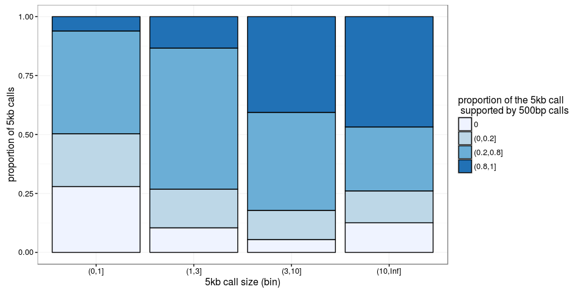
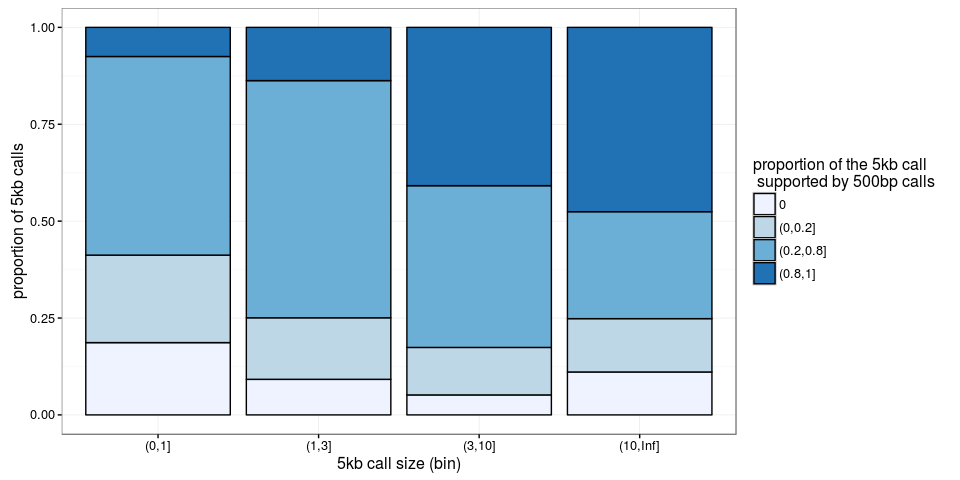
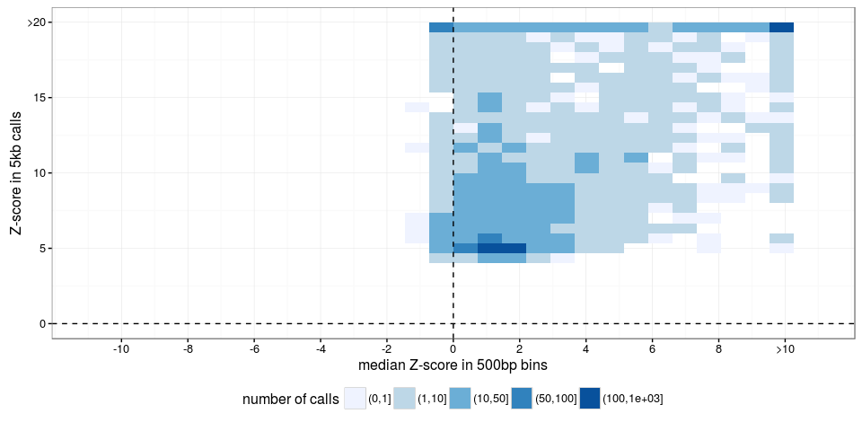
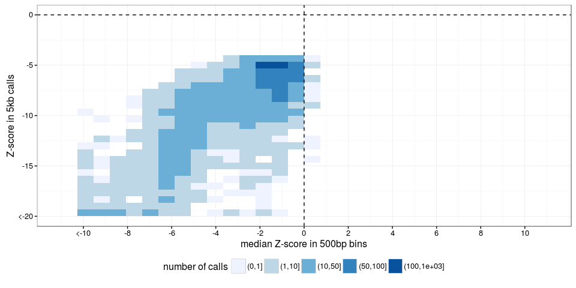
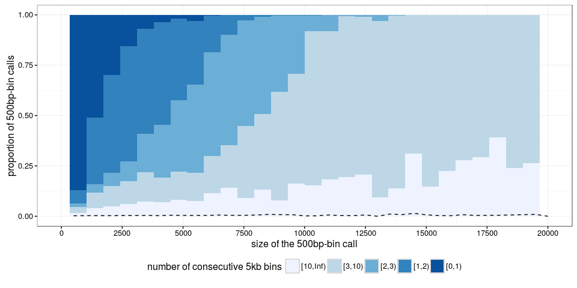
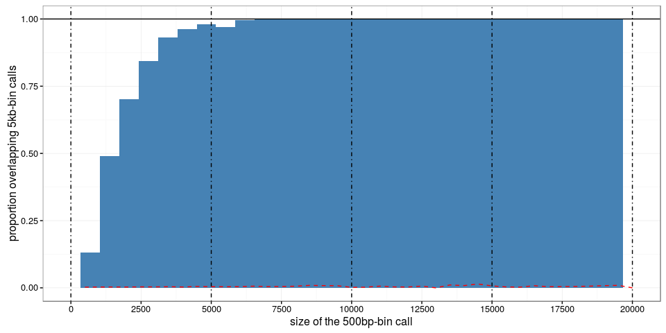

PopSV - Bin size comparison
===========================

Load packages, functions and data
---------------------------------

``` r
library(dplyr)
library(magrittr)
library(ggplot2)
library(tidyr)
library(GenomicRanges)
library(BSgenome.Hsapiens.UCSC.hg19)
library(PopSV)
source("EpiPopSV-scripts.R")

ol.df <- function(df, df2) {
    df2 = subset(df2, sample == df$sample[1])
    gr2 = with(df2, GRanges(chr, IRanges(start, end)))
    gr = with(df, GRanges(chr, IRanges(start, end)))
    ol = findOverlaps(gr, gr2)
    cov.o = tapply(width(pintersect(gr[queryHits(ol)], gr2[subjectHits(ol)]))/1000, 
        queryHits(ol), sum)
    df$ol.kb = 0
    df$ol.kb[as.numeric(names(cov.o))] = as.numeric(cov.o)
    df$ol.prop = 1000 * df$ol.kb/(df$end - df$start + 1)
    df$ol.prop = ifelse(df$ol.prop > 1, 1, df$ol.prop)
    nb.bin.cons2 = tapply(df2$nb.bin.cons[subjectHits(ol)], queryHits(ol), sum)
    df$nb.bin.cons.2 = 0
    df$nb.bin.cons.2[as.numeric(names(cov.o))] = as.numeric(nb.bin.cons2)
    df
}

## Get normal-tumor information
load("../data/cagekid-5kbp-files.RData")
normals = subset(files.df, status == "normal")$sample

## CNVs from PopSV, FREEC, CNVnator, cn.MOPS, LUMPY
load("../data/cnvs-PopSV-cagekid-5kbp-FDR001.RData")
res.lg = subset(res.df, sample %in% normals)
load("../data/cnvs-PopSV-cagekid-500bp-FDR001.RData")
res.sm = subset(res.df, sample %in% normals)

## Labels
lab.lg = "5kb"
lab.sm = "500bp"
NB.CORES = 3
```

Control: Random regions with similar sizes
------------------------------------------

``` r
seql.1.22 = seqlengths(BSgenome.Hsapiens.UCSC.hg19)[paste0("chr", 1:22)]
rand.df <- function(df) {
    widths = df$end - df$start + 1
    chrs = apply(rmultinom(length(widths), 1, (seql.1.22/1000)/sum(seql.1.22/1000)), 
        2, function(e) which(e == 1))
    starts = runif(length(widths), 0, seql.1.22[chrs] - widths)
    df$chr = chrs
    df$start = starts
    df$end = starts + widths - 1
    df
}
```

How many small-bin calls overlap large-bin call ?
-------------------------------------------------

``` r
sm.lg = res.lg %>% group_by(sample) %>% do(ol.df(., res.sm))
sm.lg$ol.prop.class = cut(sm.lg$ol.prop, breaks = c(-Inf, 0, 0.2, 0.8, 1), labels = c("0", 
    "(0,0.2]", "(0.2,0.8]", "(0.8,1]"))
sm.lg$size = cut(sm.lg$nb.bin.cons, breaks = c(0, 1, 3, 10, Inf))
sm.lg.prop = sm.lg %>% group_by(size, ol.prop.class) %>% summarize(nb = n()) %>% 
    group_by(size) %>% mutate(prop = nb/sum(nb))
ggplot(sm.lg.prop, aes(x = size, fill = ol.prop.class, y = prop)) + ggplot2::geom_bar(colour = "black", 
    stat = "identity") + theme_bw() + xlab(paste0(lab.lg, " call size (bin)")) + 
    ylab(paste0("proportion of ", lab.lg, " calls")) + scale_fill_brewer(name = paste0("proportion of the ", 
    lab.lg, " call\n supported by ", lab.sm, " calls"))
```



### Significance threshold effect

``` r
sm.lg.l = res.lg %>% filter(cn2.dev > 0.3 & qv < 1e-04) %>% group_by(sample) %>% 
    do(ol.df(., res.sm))
sm.lg.l$ol.prop.class = cut(sm.lg.l$ol.prop, breaks = c(-Inf, 0, 0.2, 0.8, 1), 
    labels = c("0", "(0,0.2]", "(0.2,0.8]", "(0.8,1]"))
sm.lg.l$size = cut(sm.lg.l$nb.bin.cons, breaks = c(0, 1, 3, 10, Inf))
sm.lg.l.prop = sm.lg.l %>% group_by(size, ol.prop.class) %>% summarize(nb = n()) %>% 
    group_by(size) %>% mutate(prop = nb/sum(nb))
ggplot(sm.lg.l.prop, aes(x = size, fill = ol.prop.class, y = prop)) + ggplot2::geom_bar(colour = "black", 
    stat = "identity") + theme_bw() + xlab(paste0(lab.lg, " call size (bin)")) + 
    ylab(paste0("proportion of ", lab.lg, " calls")) + scale_fill_brewer(name = paste0("proportion of the ", 
    lab.lg, " call\n supported by ", lab.sm, " calls"))
```



### Z-score distribution

This analysis requires the Z-scores for all 500 bp bins in the genome. Because this data is quite big, we only deposited 10 samples, chosen randomly from the 95 normal samples.

``` r
getZsm <- function(df) {
    samp = as.character(df$sample[1])
    z.f = paste0("../data/", samp, "-500bp-z.tsv.bgz")
    df$zsm.med = unlist(mclapply(1:nrow(df), function(ii) {
        z.call = read.bedix(z.f, df[ii, ])
        median(z.call$z, na.rm = TRUE)
    }, mc.cores = NB.CORES))
    df
}
samples.z = unique(res.lg$sample)
samples.z = samples.z[file.exists(paste0("../data/", samples.z, "-500bp-z.tsv.bgz"))]
sm.lg.z = res.lg %>% filter(sample %in% samples.z) %>% group_by(sample) %>% 
    do(getZsm(.))
sm.lg.z$zsm.med = winsorF(sm.lg.z$zsm.med, 10, -10)
sm.lg.z$z = winsorF(sm.lg.z$z, 20, -20)
```

``` r
ggplot(subset(sm.lg.z, z > 0), aes(x = zsm.med, y = z)) + geom_bin2d(aes(fill = cut(..count.., 
    breaks = c(0, 1, 10, 50, 100, 1000, Inf)))) + theme_bw() + scale_fill_brewer(name = "number of calls") + 
    geom_vline(xintercept = 0, linetype = 2) + geom_hline(yintercept = 0, linetype = 2) + 
    theme(legend.position = "bottom") + xlab(paste0("median Z-score in ", lab.sm, 
    " bins")) + ylab(paste0("Z-score in ", lab.lg, " calls")) + scale_x_continuous(breaks = seq(-10, 
    10, 2), labels = c(seq(-10, 8, 2), ">10"), limits = c(-11, 11)) + scale_y_continuous(breaks = seq(0, 
    20, 5), labels = c(seq(0, 15, 5), ">20"))
```



``` r
ggplot(subset(sm.lg.z, z < 0), aes(x = zsm.med, y = z)) + geom_bin2d(aes(fill = cut(..count.., 
    breaks = c(0, 1, 10, 50, 100, 1000, Inf)))) + theme_bw() + scale_fill_brewer(name = "number of calls") + 
    geom_vline(xintercept = 0, linetype = 2) + geom_hline(yintercept = 0, linetype = 2) + 
    theme(legend.position = "bottom") + xlab(paste0("median Z-score in ", lab.sm, 
    " bins")) + ylab(paste0("Z-score in ", lab.lg, " calls")) + scale_x_continuous(breaks = seq(10, 
    -10, -2), labels = c(seq(10, -8, -2), "<-10"), limits = c(-11, 11)) + scale_y_continuous(breaks = seq(0, 
    -20, -5), labels = c(seq(0, -15, -5), "<-20"))
```



Overlap large bins on small bins
--------------------------------

``` r
bin.size.sm = 500
bin.size.lg = 5000
bin.size.diff = bin.size.lg/bin.size.sm

lg.sm = res.sm %>% group_by(sample) %>% do(ol.df(., res.lg))
lg.sm$size2 = cut(lg.sm$nb.bin.cons.2, breaks = c(0, 1, 2, 3, 10, Inf), right = FALSE)
lg.sm$size2 = factor(lg.sm$size2, levels = rev(levels(lg.sm$size2)))

lg.sm.null = mclapply(1:3, function(ii) res.sm %>% group_by(sample) %>% do(ol.df(rand.df(.), 
    res.lg)), mc.cores = NB.CORES)
lg.sm.null = do.call(rbind, lg.sm.null)
lg.sm.null = lg.sm.null %>% group_by(nb.bin.cons) %>% summarize(prop0 = mean(nb.bin.cons.2 != 
    0)) %>% group_by(nb.bin.cons) %>% summarize(prop0 = mean(prop0))

lg.sm$size = lg.sm$nb.bin.cons * bin.size.sm
lg.sm.null$size = lg.sm.null$nb.bin.cons * bin.size.sm

ggplot() + geom_histogram(aes(x = size, fill = size2), data = lg.sm, position = "fill") + 
    theme_bw() + xlab(paste0("size of the ", lab.sm, "-bin call")) + scale_fill_brewer(name = paste0("number of consecutive ", 
    lab.lg, " bins")) + theme(legend.position = "bottom") + ylab(paste0("proportion of ", 
    lab.sm, "-bin calls")) + geom_line(aes(x = size, y = prop0), data = lg.sm.null, 
    linetype = 2) + scale_x_continuous(breaks = seq(0, 40, bin.size.diff/2) * 
    bin.size.sm, lim = c(0, 40 * bin.size.sm))
```



``` r
ggplot() + geom_histogram(aes(x = size, fill = size2 == "[0,1)", alpha = size2 == 
    "[0,1)"), data = lg.sm, position = "fill") + theme_bw() + xlab(paste0("size of the ", 
    lab.sm, "-bin call")) + scale_fill_manual(name = paste0("overlaps ", lab.lg, 
    " calls"), values = c("steelblue", "white"), label = c("TRUE", "FALSE")) + 
    theme(legend.position = "bottom") + ylab(paste0("proportion overlapping ", 
    lab.lg, "-bin calls")) + geom_line(aes(x = size, y = prop0), data = lg.sm.null, 
    colour = "red", linetype = 2) + geom_vline(xintercept = seq(0, 40, bin.size.diff) * 
    bin.size.sm, linetype = 4) + geom_hline(yintercept = 1) + guides(fill = FALSE, 
    alpha = FALSE) + scale_x_continuous(breaks = seq(0, 40, bin.size.diff/2) * 
    bin.size.sm, lim = c(0, 40 * bin.size.sm)) + scale_alpha_manual(values = 1:0)
```


