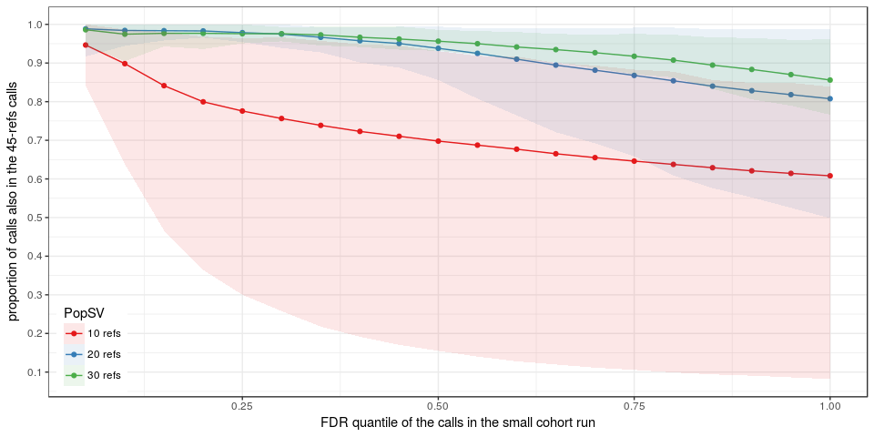
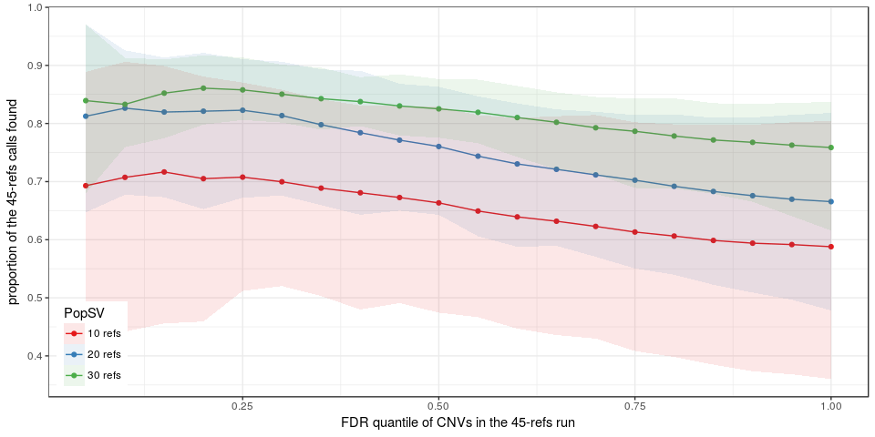

Effect of the cohort size
=========================

Load packages, functions and data
---------------------------------

``` r
library(dplyr)
library(magrittr)
library(ggplot2)
library(PopSV)
library(GenomicRanges)
library(ggdendro)
library(fpc)
source("EpiPopSV-scripts.R")

## Get pedigree information
load("../data/twins-5kbp-files.RData")
ped = files.df[, c("sample", "family", "ped")]
ped$samp.short = paste(ped$family, ped$ped, sep = "-")
ped$samp.short[which(is.na(ped$family))] = paste0("other", 1:sum(is.na(ped$family)))
ped$ped2 = ped$ped %>% gsub("Twin1", "Twin", .) %>% gsub("Twin2", "Twin", .)
rownames(ped) = ped$sample

## CNVs from PopSV (45 samples as reference)
load("../data/cnvs-PopSV-twin-5kbp-FDR001.RData")
res.df$PopSV = "45 refs"
## CNVs from PopSV with 10, 20 and 30 samples used as reference
res.l = lapply(c(10, 20, 30), function(size) {
    res = read.table(paste0("../data/cnvs-autosomal-PopSV-refs", size, "-FDR001.tsv.gz"), 
        header = TRUE, as.is = TRUE)
    res$PopSV = paste(size, "refs")
    res
})
cnv.df = rbind(res.df, do.call(rbind, res.l))

## Palette and method order
PopSVs.f = paste(c(10, 20, 30, 45), "refs")
cnv.df$PopSV = factor(as.character(cnv.df$PopSV), levels = PopSVs.f)
cnv.df = cnv.df %>% group_by(PopSV) %>% do(freq.range(., annotate.only = TRUE))

twins = subset(files.df, grepl("Twin", ped))$sample
cnv.s = cnv.df %>% filter(prop < 0.5, sample %in% twins)

load("../data/cnvs-PopSV-twin-5kbp-FDR05.RData")
res.df$PopSV = "45 refs"
res.l = lapply(c(10, 20, 30), function(size) {
    res = read.table(paste0("../data/cnvs-autosomal-PopSV-refs", size, "-FDR05.tsv.gz"), 
        header = TRUE, as.is = TRUE)
    res$PopSV = paste(size, "refs")
    res
})
cnv.l = rbind(res.df, do.call(rbind, res.l))
cnv.l = subset(cnv.l, sample %in% twins)

## Sample information
samp.info = files.df[, c("sample", "family", "ped")]
cnv.s = merge(cnv.s, samp.info)
cnv.l = merge(cnv.l, samp.info)
```

Variants called in several runs
-------------------------------

``` r
olMethods <- function(df, df2) {
    ol = findOverlaps(makeGRangesFromDataFrame(df), makeGRangesFromDataFrame(df2))
    ol.meth = tapply(df2$PopSV[subjectHits(ol)], queryHits(ol), function(x) unique(x))
    df = df[rep(as.numeric(names(ol.meth)), unlist(lapply(ol.meth, length))), 
        ]
    df$PopSV2 = as.character(unlist(ol.meth))
    df
}
meth.df = cnv.s %>% group_by(sample) %>% do(olMethods(., subset(cnv.l, sample == 
    .$sample[1])))

methd2d.sig <- function(df) {
    res = lapply(seq(0, 1, 0.05), function(sigq) {
        sigq.v = df %>% filter(PopSV2 == PopSV) %>% .$qv %>% quantile(probs = sigq)
        cnvs = df %>% filter(PopSV2 == PopSV, qv < sigq.v) %>% group_by(sample) %>% 
            summarize(cnvs = n())
        df %>% filter(PopSV2 == "45 refs", qv < sigq.v) %>% group_by(sample) %>% 
            summarize(cnvs45 = n()) %>% mutate(sigq = sigq, qv = sigq.v) %>% 
            merge(cnvs)
    })
    do.call(rbind, res)
}
cnvsSS.prop = meth.df %>% filter(PopSV != "45 refs") %>% group_by(PopSV) %>% 
    do(methd2d.sig(.))

cnvsSS.prop %>% group_by(PopSV, sigq) %>% summarize(cnv.prop = mean(cnvs45/cnvs), 
    prop.u = quantile(cnvs45/cnvs, 1), prop.l = quantile(cnvs45/cnvs, 0)) %>% 
    ggplot(aes(x = sigq, y = cnv.prop, colour = PopSV)) + geom_point() + theme_bw() + 
    geom_line() + geom_ribbon(aes(fill = PopSV, ymin = prop.l, ymax = prop.u), 
    alpha = 0.1, size = 0) + ylab("proportion of calls also in the 45-refs calls") + 
    xlab("FDR quantile of the calls in the small cohort run") + theme(legend.position = c(0.01, 
    0.01), legend.justification = c(0, 0)) + ylim(0, 1) + scale_y_continuous(breaks = seq(0, 
    1, 0.1)) + scale_colour_brewer(name = "PopSV", palette = "Set1") + scale_fill_brewer(name = "PopSV", 
    palette = "Set1")
```



``` r
cnvs45.prop = lapply(seq(0, 1, 0.05), function(sigq) {
    sigq.v = meth.df %>% filter(PopSV == "45 refs", PopSV2 == PopSV) %>% .$qv %>% 
        quantile(probs = sigq)
    cnvs45 = meth.df %>% filter(PopSV == "45 refs", PopSV2 == PopSV, qv < sigq.v) %>% 
        group_by(sample) %>% summarize(cnvs45 = n())
    meth.df %>% filter(PopSV == "45 refs", PopSV2 != PopSV, qv < sigq.v) %>% 
        group_by(PopSV2, sample) %>% summarize(cnvs = n()) %>% mutate(sigq = sigq, 
        qv = sigq.v) %>% merge(cnvs45)
})
cnvs45.prop = do.call(rbind, cnvs45.prop)

cnvs45.prop %>% group_by(PopSV2, sigq) %>% summarize(cnv.prop = mean(cnvs/cnvs45), 
    prop.u = quantile(cnvs/cnvs45, 1), prop.l = quantile(cnvs/cnvs45, 0)) %>% 
    ggplot(aes(x = sigq, y = cnv.prop, colour = PopSV2)) + geom_point() + theme_bw() + 
    geom_line() + geom_ribbon(aes(fill = PopSV2, ymin = prop.l, ymax = prop.u), 
    alpha = 0.1, size = 0) + ylab("proportion of the 45-refs calls found") + 
    xlab("FDR quantile of CNVs in the 45-refs run") + theme(legend.position = c(0.01, 
    0.01), legend.justification = c(0, 0)) + ylim(0, 1) + scale_y_continuous(breaks = seq(0, 
    1, 0.1)) + scale_colour_brewer(name = "PopSV", palette = "Set1") + scale_fill_brewer(name = "PopSV", 
    palette = "Set1")
```



Replication in twins
--------------------

``` r
concordance.twin <- function(cnv.df, cnv.2.df) {
    ol.df = as.data.frame(findOverlaps(makeGRangesFromDataFrame(cnv.df, keep.extra.columns = TRUE), 
        makeGRangesFromDataFrame(cnv.2.df, keep.extra.columns = TRUE)))
    ol.df$samp.q = cnv.df$sample[ol.df$queryHits]
    ol.df$samp.s = cnv.2.df$sample[ol.df$subjectHits]
    ol.df$fam.q = cnv.df$family[ol.df$queryHits]
    ol.df$fam.s = cnv.2.df$family[ol.df$subjectHits]
    ol.s = ol.df %>% group_by(queryHits) %>% summarize(conc = any(fam.s == fam.q & 
        samp.s != samp.q))
    cnv.df$conc = FALSE
    cnv.df$conc[subset(ol.s, conc)$queryHits] = TRUE
    cnv.df
}

cnv.s = cnv.s %>% group_by(PopSV) %>% do(concordance.twin(., subset(cnv.l, PopSV == 
    .$PopSV[1]))) %>% ungroup

conc.sum.sig <- function(df) {
    res = lapply(seq(0, 1, 0.05), function(sigq) {
        sigq.v = quantile(df$qv, probs = sigq)
        df %>% filter(qv < sigq.v) %>% group_by(sample) %>% summarize(nb.c = sum(conc), 
            prop.c = mean(conc)) %>% mutate(sigq = sigq)
    })
    do.call(rbind, res)
}
conc.tw.sig = cnv.s %>% group_by(PopSV) %>% do(conc.sum.sig(.))

conc.tw.sig %>% group_by(PopSV, sigq) %>% summarize(nb.c = mean(nb.c), prop.u = quantile(prop.c, 
    1), prop.l = quantile(prop.c, 0), prop.c = mean(prop.c)) %>% ggplot(aes(x = nb.c, 
    y = prop.c, colour = PopSV)) + geom_point() + theme_bw() + geom_line() + 
    geom_ribbon(aes(fill = PopSV, ymin = prop.l, ymax = prop.u), alpha = 0.1, 
        size = 0) + ylab("proportion of replicated calls per sample") + xlab("number of replicated calls per sample") + 
    theme(legend.position = c(0.01, 0.01), legend.justification = c(0, 0)) + 
    scale_colour_brewer(name = "PopSV", palette = "Set1") + scale_fill_brewer(name = "PopSV", 
    palette = "Set1")
```


