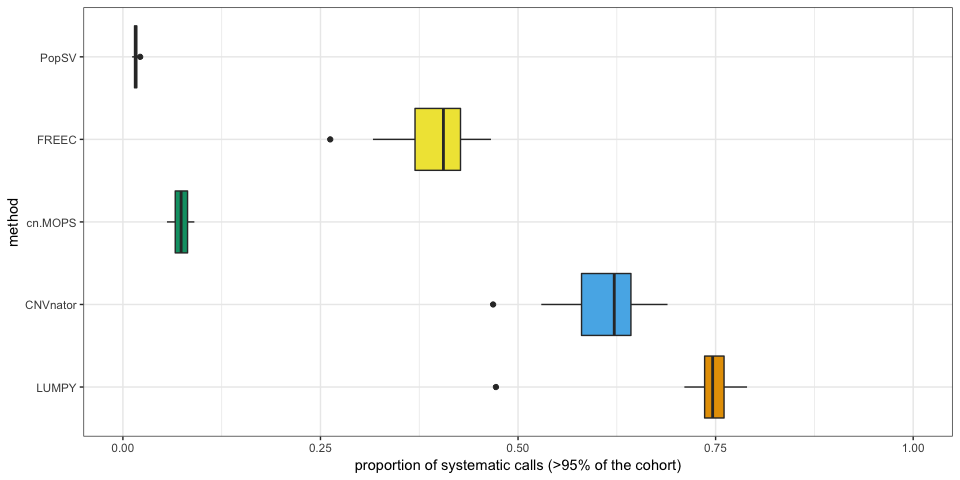
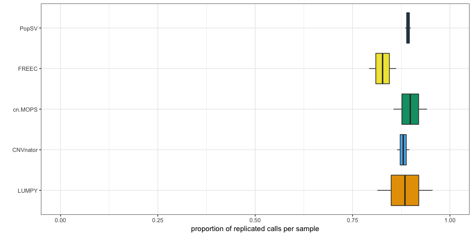
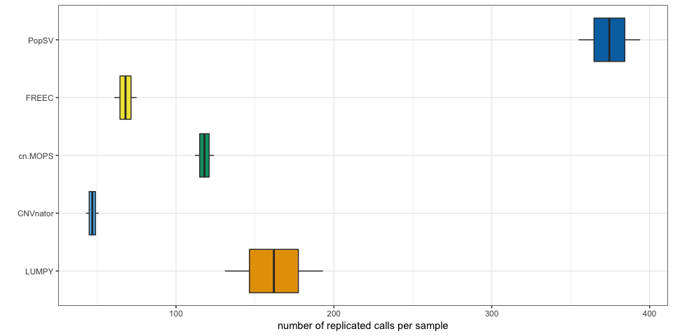
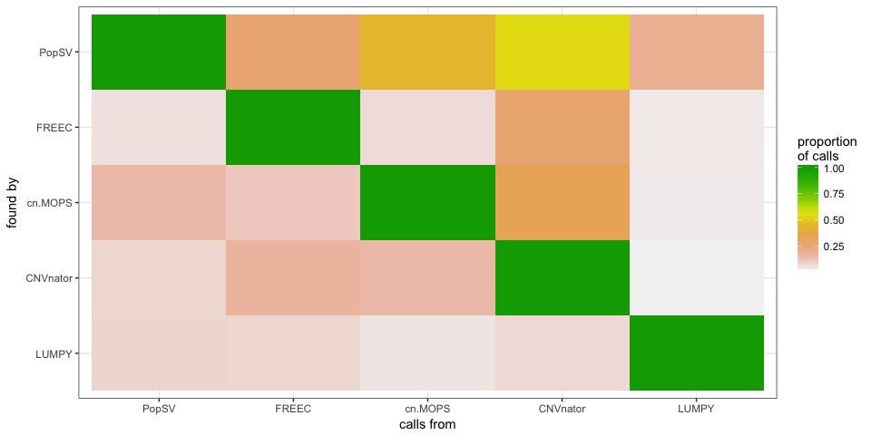

PopSV - Methods benchmark using the Twin dataset
================================================

Load packages, functions and data
---------------------------------

``` r
library(dplyr)
library(magrittr)
library(ggplot2)
library(PopSV)
library(GenomicRanges)
source("EpiPopSV-scripts.R")

## Get normal-tumor information
load("../data/cagekid-5kbp-files.RData")
normals = subset(files.df, status == "normal")$sample
inds = subset(files.df, sample %in% normals)$individual
tumors = subset(files.df, individual %in% inds & status == "tumor")$sample

## CNVs from PopSV, FREEC, CNVnator, cn.MOPS, LUMPY
load("../data/cnvs-PopSV-cagekid-5kbp-FDR001.RData")
cnv.s = subset(res.df, sample %in% normals)
rm(res.df)
cnv.s = data.frame(method = "PopSV", set = "stringent", cnv.s[, c("sample", 
    "chr", "start", "end")])
load("../data/cnvs-PopSV-cagekid-5kbp-FDR05.RData")
cnv.l = subset(res.df, sample %in% tumors)
rm(res.df)
cnv.l = data.frame(method = "PopSV", set = "loose", cnv.l[, c("sample", "chr", 
    "start", "end")])
load("../data/cnvs-otherMethods-cagekid-5kbp.RData")
others.df = subset(others.df, method != "LUMPY")
cnv.s = rbind(cnv.s, subset(others.df, sample %in% normals & set == "stringent")[, 
    c("method", "set", "sample", "chr", "start", "end")])
cnv.l = rbind(cnv.l, subset(others.df, sample %in% tumors & set == "loose")[, 
    c("method", "set", "sample", "chr", "start", "end")])
rm(others.df)

## Palette and method order
cbPalette <- c("#E69F00", "#56B4E9", "#009E73", "#F0E442", "#0072B2", "#D55E00", 
    "#CC79A7")
methods.f = c("LUMPY", "CNVnator", "cn.MOPS", "FREEC", "PopSV")
cnv.s$method = factor(as.character(cnv.s$method), levels = methods.f)
cnv.l$method = factor(as.character(cnv.l$method), levels = methods.f)
```

Note: LUMPY calls are not included here (yet), because of memory problems during the frequency annotation. For the paper, we used high memory node on a computing cluster to include these calls.

Systematic calls ?
------------------

How many systematic calls do we get in a typical sample ?

The distribution shows the average proportion of calls in one sample, grouped by their frequency in the full cohort.

``` r
cnv.s = cnv.s %>% group_by(method) %>% do(freq.range(., annotate.only = TRUE))
cnv.ave.samp = cnv.s %>% mutate(prop = cut(prop, seq(0, 1, 0.05), labels = seq(0.05, 
    1, 0.05))) %>% group_by(method, sample, prop) %>% summarize(call = n()) %>% 
    group_by(method, sample) %>% mutate(call = call/sum(call))
cnv.ave.samp %>% group_by(method, prop) %>% summarize(call = mean(call)) %>% 
    ggplot(aes(x = prop, y = call, fill = method)) + geom_bar(stat = "identity") + 
    facet_grid(method ~ ., scales = "free") + theme_bw() + scale_fill_manual(values = cbPalette) + 
    guides(fill = FALSE) + xlab("frequency") + ylab("proportion of calls")
```


``` r
cnv.ave.samp %>% filter(prop == "1") %>% ggplot(aes(x = method, y = call, fill = method)) + 
    geom_boxplot() + theme_bw() + coord_flip() + scale_fill_manual(values = cbPalette) + 
    guides(fill = FALSE) + ylim(0, 1) + ylab("proportion of systematic calls (>95% of the cohort)")
```



Replication in the paired tumor
-------------------------------

``` r
samp.info = files.df[, c("sample", "individual")]
cnv.s = merge(cnv.s, samp.info)
cnv.l = merge(cnv.l, samp.info)

concordance.nt <- function(cnv.df, cnv.2.df) {
    cnv.df = subset(cnv.df, individual %in% unique(cnv.2.df$individual))
    ol.df = as.data.frame(findOverlaps(makeGRangesFromDataFrame(cnv.df, keep.extra.columns = TRUE), 
        makeGRangesFromDataFrame(cnv.2.df, keep.extra.columns = TRUE)))
    ol.df$ind.q = cnv.df$individual[ol.df$queryHits]
    ol.df$ind.s = cnv.2.df$individual[ol.df$subjectHits]
    ol.s = ol.df %>% group_by(queryHits) %>% summarize(conc = any(ind.s == ind.q))
    cnv.df$conc = FALSE
    cnv.df$conc[subset(ol.s, conc)$queryHits] = TRUE
    cnv.df
}

cnv.s = cnv.s %>% group_by(method) %>% do(concordance.nt(., subset(cnv.l, method == 
    .$method[1]))) %>% ungroup %>% mutate(conc.null = as.logical(rbinom(n(), 
    1, prop)))
```

``` r
conc.nt = cnv.s %>% filter(prop < 0.5) %>% group_by(sample, method) %>% summarize(nb.c = sum(conc), 
    prop.c = mean(conc), nb.c.null = sum(conc.null), prop.c.null = mean(conc.null)) %>% 
    mutate(method = factor(as.character(method), levels = methods.f))
ggplot(conc.nt, aes(x = method, y = prop.c)) + geom_boxplot(aes(fill = method)) + 
    theme_bw() + xlab("") + ylab("proportion of replicated calls per sample") + 
    ylim(0, 1) + coord_flip() + guides(fill = FALSE) + scale_fill_manual(values = cbPalette)
```



``` r
ggplot(conc.nt, aes(x = method, y = nb.c - nb.c.null)) + geom_boxplot(aes(fill = method)) + 
    theme_bw() + xlab("") + ylab("number of replicated calls per sample") + 
    coord_flip() + guides(fill = FALSE) + scale_fill_manual(values = cbPalette)
```



Bias ?
------

Checking for potential bias when fragmented calls in one method versus stitched calls in another might duplicate the number of "calls" in the first method.

Let's see how many calls in one method overlaps several calls in another method

``` r
event.duplication.check <- function(cnv.o, methods = c("PopSV", "FREEC")) {
    gr1 = with(subset(cnv.o, method == methods[1]), GRanges(chr, IRanges(start, 
        end)))
    gr2 = with(subset(cnv.o, method == methods[2]), GRanges(chr, IRanges(start, 
        end)))
    ol = suppressWarnings(findOverlaps(gr1, gr2))
    if (length(ol) == 0) 
        return(data.frame(nb.ol = NA, count = NA, method = NA))
    ol.1 = as.data.frame(table(table(queryHits(ol))))
    ol.1$method = methods[1]
    ol.2 = as.data.frame(table(table(subjectHits(ol))))
    ol.2$method = methods[2]
    ol.df = rbind(ol.1, ol.2)
    colnames(ol.df)[1:2] = c("nb.ol", "count")
    ol.df$nb.ol = as.integer(as.character(ol.df$nb.ol))
    ol.df
}
dup.check = cnv.s %>% filter(prop < 0.5) %>% group_by(sample) %>% do({
    other.meth = setdiff(unique(.$method), "PopSV")
    tobind = lapply(other.meth, function(meth) {
        data.frame(comp = paste0("PopSV-", meth), event.duplication.check(., 
            methods = c("PopSV", meth)))
    })
    do.call(rbind, tobind)
})
dup.check = as.data.frame(dup.check)
dup.check$method = factor(as.character(dup.check$method), levels = methods.f)
```

``` r
ggplot(subset(dup.check, !is.na(nb.ol)), aes(x = winsorF(nb.ol, 3), y = count, 
    fill = method, group = paste(method, winsorF(nb.ol, 3)))) + geom_boxplot() + 
    theme_bw() + xlab("overlapping X calls from other method") + ylab("number of calls per sample") + 
    facet_grid(comp ~ ., scales = "free") + theme(text = element_text(size = 18), 
    legend.position = "top") + scale_fill_manual(values = cbPalette) + scale_x_continuous(breaks = 1:3, 
    labels = c(1, 2, "3+")) + coord_flip()
```


