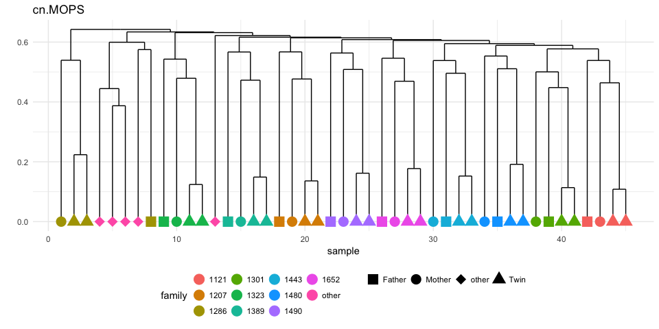
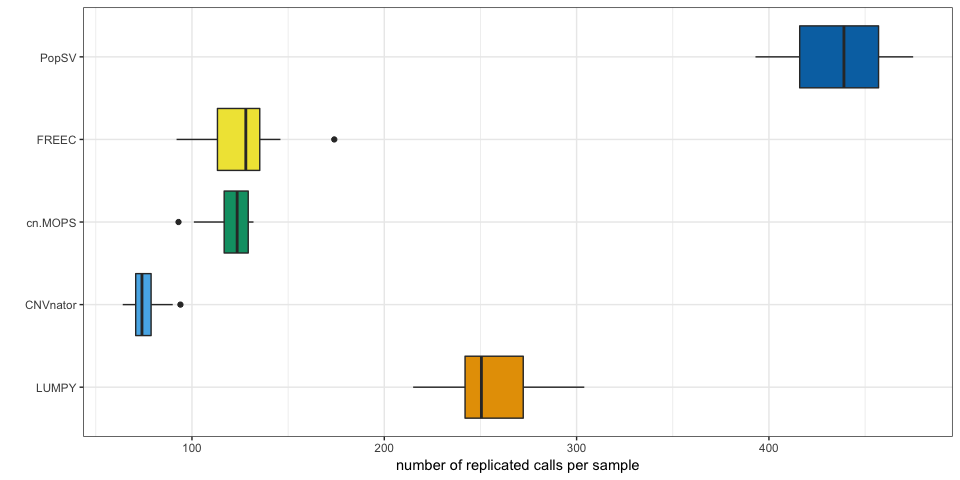
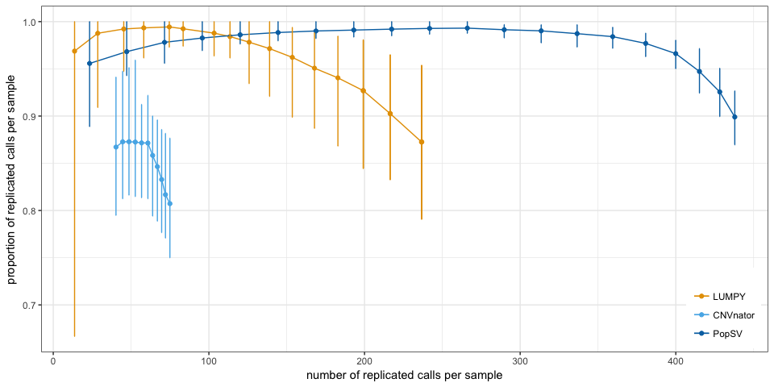
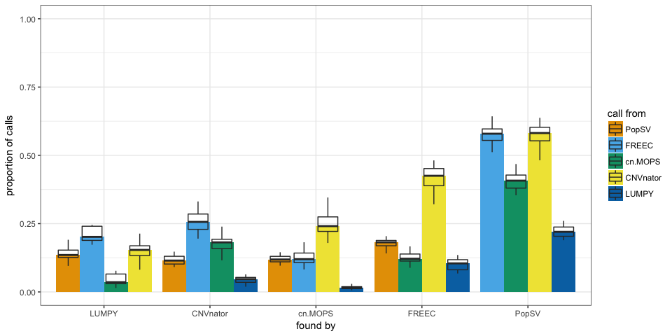
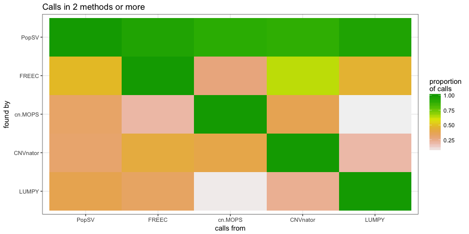
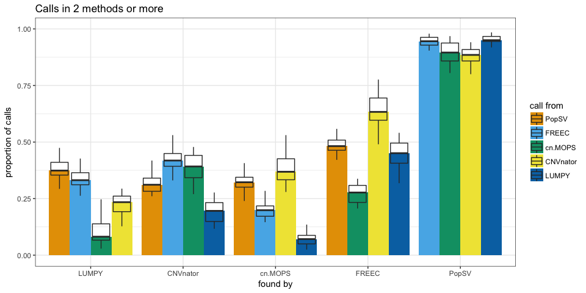
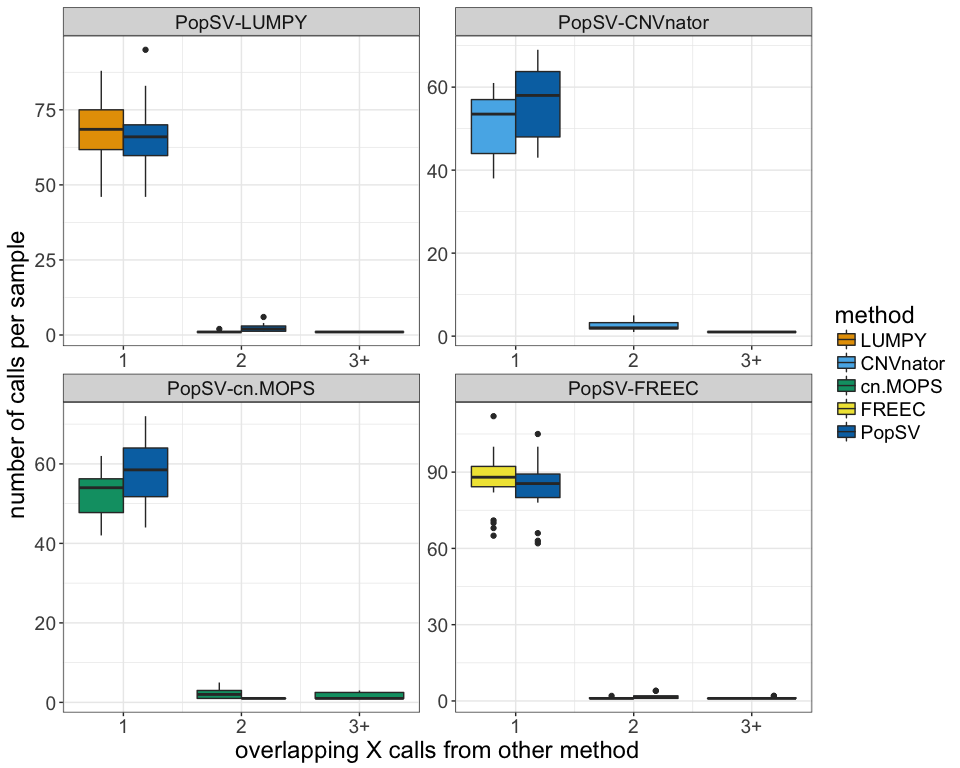

PopSV - Methods benchmark using the Twin dataset
================================================

Load packages, functions and data
---------------------------------

``` r
library(dplyr)
library(magrittr)
library(ggplot2)
library(PopSV)
library(GenomicRanges)
library(ggdendro)
library(fpc)
source("EpiPopSV-scripts.R")

## Get pedigree information
load("../data/twins-5kbp-files.RData")
ped = files.df[, c("sample", "family", "ped")]
ped$samp.short = paste(ped$family, ped$ped, sep = "-")
ped$samp.short[which(is.na(ped$family))] = paste0("other", 1:sum(is.na(ped$family)))
ped$ped2 = ped$ped %>% gsub("Twin1", "Twin", .) %>% gsub("Twin2", "Twin", .)
rownames(ped) = ped$sample

## CNVs from PopSV, FREEC, CNVnator, cn.MOPS, LUMPY
load("../data/cnvs-PopSV-twin-5kbp-FDR001.RData")
res.df$method = "PopSV"
res.df$sig = res.df$qv
load("../data/cnvs-otherMethods-twin-5kbp.RData")
com.cols = intersect(colnames(res.df), colnames(others.df))
res.df = rbind(res.df[, com.cols], subset(others.df, set == "stringent")[, com.cols])

## Palette and method order
cbPalette <- c("#E69F00", "#56B4E9", "#009E73", "#F0E442", "#0072B2", "#D55E00", 
    "#CC79A7")
methods.f = c("LUMPY", "CNVnator", "cn.MOPS", "FREEC", "PopSV")
res.df$method = factor(as.character(res.df$method), levels = methods.f)
```

Systematic calls ?
------------------

How many systematic calls do we get in a typical sample ?

The distribution shows the average proportion of calls in one sample, grouped by their frequency in the full cohort.

``` r
res.df = res.df %>% group_by(method) %>% do(freq.range(., annotate.only = TRUE))
res.ave.samp = res.df %>% mutate(prop = cut(prop, seq(0, 1, 0.05), labels = seq(0.05, 
    1, 0.05))) %>% group_by(method, sample, prop) %>% summarize(call = n()) %>% 
    group_by(method, sample) %>% mutate(call = call/sum(call))
res.ave.samp %>% group_by(method, prop) %>% summarize(call = mean(call)) %>% 
    ggplot(aes(x = prop, y = call, fill = method)) + geom_bar(stat = "identity") + 
    facet_grid(method ~ ., scales = "free") + theme_bw() + scale_fill_manual(values = cbPalette) + 
    guides(fill = FALSE) + xlab("frequency") + ylab("proportion of calls")
```


``` r
res.ave.samp %>% filter(prop == "1") %>% ggplot(aes(x = method, y = call, fill = method)) + 
    geom_boxplot() + theme_bw() + coord_flip() + scale_fill_manual(values = cbPalette) + 
    guides(fill = FALSE) + ylim(0, 1) + ylab("proportion of systematic calls (>95% of the cohort)")
```


Cluster samples using CNV calls
-------------------------------

``` r
ggfamily <- function(hc.o) {
    dd <- dendro_data(hc.o)
    l.df = dd$labels
    l.df = cbind(l.df, ped[as.character(l.df$label), ])
    l.df %<>% mutate(family = ifelse(is.na(family), "other", family), ped2 = ifelse(is.na(ped2), 
        "other", ped2))
    ggplot(dd$segments) + geom_segment(aes(x = x, y = y, xend = xend, yend = yend)) + 
        geom_point(aes(x = x, y = y, colour = factor(family), shape = factor(ped2)), 
            size = 5, data = l.df) + scale_colour_hue(name = "family") + scale_shape_manual(name = "", 
        values = c(15, 16, 18, 17, 17)) + theme_minimal() + theme(plot.background = element_rect(colour = "white"), 
        legend.position = "bottom") + xlab("sample") + ylab("")
}
cluster.cnv <- function(cnv.df, cl.method = "complete") {
    samples = unique(cnv.df$sample)
    samp.o = 1:length(samples)
    names(samp.o) = samples
    cnv.gr = makeGRangesFromDataFrame(cnv.df, keep.extra.columns = TRUE)
    w.samp.kb = tapply(width(cnv.gr), factor(cnv.df$sample, levels = samples), 
        function(w) sum(w/1000))
    ol = as.data.frame(findOverlaps(cnv.gr, cnv.gr))
    ol$samp.q = samp.o[cnv.df$sample[ol$queryHits]]
    ol$samp.s = samp.o[cnv.df$sample[ol$subjectHits]]
    ol = subset(ol, samp.q < samp.s)
    ol$w.ol = width(pintersect(cnv.gr[ol$queryHits], cnv.gr[ol$subjectHits]))
    d.df = ol %>% group_by(samp.q, samp.s) %>% summarize(d = 1 - (2 * sum(w.ol/1000)/sum(w.samp.kb[c(samp.q[1], 
        samp.s[1])])))
    d.mat = matrix(NA, length(samples), length(samples))
    rownames(d.mat) = colnames(d.mat) = samples
    for (ii in 1:nrow(d.df)) d.mat[d.df$samp.q[ii], d.df$samp.s[ii]] = d.mat[d.df$samp.s[ii], 
        d.df$samp.q[ii]] = d.df$d[ii]
    ## Adding pseudo count for 0 distance (happens when few regions are used,
    ## e.g. low-coverage FREEC)
    if (any(d.mat == 0, na.rm = TRUE)) 
        d.mat[which(d.mat == 0)] = 1e-04
    hc = hclust(as.dist(d.mat), method = cl.method)
    return(list(d = d.mat, hc = hc))
}
randi.explore <- function(d, ped, cut.int = 2:20, methods.to.test = c("ave", 
    "comp", "ward.D")) {
    families = as.numeric(factor(ped$family))
    families[which(is.na(families))] = seq(1 + max(families, na.rm = TRUE), 
        length.out = sum(is.na(families)))
    res.l = lapply(methods.to.test, function(mtt) {
        hc = hclust(d, method = mtt)
        res.l = lapply(cut.int, function(ci) {
            gp.cl = cutree(hc, ci)
            gp.cl = gp.cl[ped$sample]
            data.frame(cl.meth = mtt, nb.cut = ci, rand.ind = cluster.stats(d, 
                gp.cl, families)$corrected.rand)
        })
        do.call(rbind, res.l)
    })
    do.call(rbind, res.l)
}
clMethod <- function(df) {
    meth = df$method[1]
    pdf.l = list()
    cl.cnv = cluster.cnv(df, cl.method = "ave")
    ## Rand index exploration
    ri.df = randi.explore(dist(cl.cnv$d), ped, 2:(ncol(cl.cnv$d) - 1))
    list(dendro = ggfamily(cl.cnv$hc) + ggtitle(meth), hc = cl.cnv$hc, ri.df = data.frame(method = meth, 
        ri.df))
}

res.l = lapply(unique(res.df$method), function(meth) {
    clMethod(subset(res.df, method == meth))
})
```

### Rand index

``` r
ri.df = do.call(rbind, lapply(res.l, function(l) l$ri.df))
ri.s = aggregate(rand.ind ~ method + nb.cut, data = ri.df, max)
ri.df = as.data.frame(ri.df)
ri.df$method = factor(as.character(ri.df$method), levels = methods.f)
ri.s = as.data.frame(ri.s)
ri.s$method = factor(as.character(ri.s$method), levels = methods.f)

ggplot(ri.df, aes(x = nb.cut, y = rand.ind, colour = method, linetype = cl.meth)) + 
    geom_point() + geom_line() + ylim(0, 1) + scale_linetype(name = "clustering linkage", 
    label = c("average", "complete", "Ward")) + theme_bw() + xlab("number of groups derived from CNV clustering") + 
    ylab("Rand index using pedigree information") + theme(legend.position = c(1, 
    1), legend.justification = c(1, 1), text = element_text(size = 18)) + scale_colour_manual(values = cbPalette)
```


``` r
ggplot(ri.df, aes(x = nb.cut, y = rand.ind, colour = method)) + geom_point(aes(shape = cl.meth), 
    alpha = 1) + geom_line(size = 2, alpha = 0.5, data = ri.s) + ylim(0, 1) + 
    scale_shape(name = "clustering linkage", label = c("average", "complete", 
        "Ward")) + theme_bw() + xlab("number of groups derived from CNV clustering") + 
    ylab("Rand index using pedigree information") + theme(legend.position = c(1, 
    1), legend.justification = c(1, 1), text = element_text(size = 18)) + scale_colour_manual(values = cbPalette)
```


### Dendogram

``` r
lapply(res.l, function(l) l$dendro)
```

    ## [[1]]


    ## 
    ## [[2]]


    ## 
    ## [[3]]



    ## 
    ## [[4]]


    ## 
    ## [[5]]


Replication in the second twin
------------------------------

``` r
twins = subset(files.df, grepl("Twin", ped))$sample
cnv.s = res.df %>% filter(prop < 0.5, sample %in% twins)
load("../data/cnvs-PopSV-twin-5kbp-FDR05.RData")
res.df$sig = res.df$qv
cnv.l = data.frame(method = "PopSV", set = "loose", res.df[, c("sample", "chr", 
    "start", "end", "sig")])
cnv.l = rbind(cnv.l, subset(others.df, set == "loose")[, c("method", "set", 
    "sample", "chr", "start", "end", "sig")])
cnv.l = subset(cnv.l, sample %in% twins)
## Sample information
samp.info = files.df[, c("sample", "family", "ped")]
cnv.s = merge(cnv.s, samp.info)
cnv.l = merge(cnv.l, samp.info)

concordance.twin <- function(cnv.df, cnv.2.df) {
    ol.df = as.data.frame(findOverlaps(makeGRangesFromDataFrame(cnv.df, keep.extra.columns = TRUE), 
        makeGRangesFromDataFrame(cnv.2.df, keep.extra.columns = TRUE)))
    ol.df$samp.q = cnv.df$sample[ol.df$queryHits]
    ol.df$samp.s = cnv.2.df$sample[ol.df$subjectHits]
    ol.df$fam.q = cnv.df$family[ol.df$queryHits]
    ol.df$fam.s = cnv.2.df$family[ol.df$subjectHits]
    ol.s = ol.df %>% group_by(queryHits) %>% summarize(conc = any(fam.s == fam.q & 
        samp.s != samp.q))
    cnv.df$conc = FALSE
    cnv.df$conc[subset(ol.s, conc)$queryHits] = TRUE
    cnv.df
}

cnv.s = cnv.s %>% group_by(method) %>% do(concordance.twin(., subset(cnv.l, 
    method == .$method[1]))) %>% ungroup
```

``` r
conc.tw = cnv.s %>% group_by(sample, method) %>% summarize(nb.c = sum(conc), 
    prop.c = mean(conc)) %>% mutate(method = factor(as.character(method), levels = methods.f))
ggplot(conc.tw, aes(x = method, y = prop.c)) + geom_boxplot(aes(fill = method)) + 
    theme_bw() + xlab("") + ylab("proportion of replicated calls per sample") + 
    ylim(0, 1) + coord_flip() + guides(fill = FALSE) + scale_fill_manual(values = cbPalette)
```


``` r
ggplot(conc.tw, aes(x = method, y = nb.c)) + geom_boxplot(aes(fill = method)) + 
    theme_bw() + xlab("") + ylab("number of replicated calls per sample") + 
    coord_flip() + guides(fill = FALSE) + scale_fill_manual(values = cbPalette)
```



For LUMPY, CNVnator and PopSV we can further play with post-calling metrics. How does the performance change when playing with the calls' significance. For LUMPY, we use the number of supporting reads, for CNVnator the minimum of `eval1` and `eval2` and for PopSV the Q-value. More information on the `formatCalls-CNVnator-FREEC-LUMPY-cnMOPS.R` script (in the `others` folder).

``` r
conc.sum.sig <- function(df) {
    res = lapply(seq(0, 1, 0.05), function(sigq) {
        sigq.v = quantile(df$sig, probs = sigq)
        df %>% filter(sig < sigq.v) %>% group_by(sample) %>% summarize(nb.c = sum(conc), 
            prop.c = mean(conc)) %>% mutate(sigq = sigq)
    })
    do.call(rbind, res)
}
conc.tw.sig = cnv.s %>% filter(!is.na(sig)) %>% group_by(method) %>% do(conc.sum.sig(.))

conc.tw.sig %>% group_by(method, sigq) %>% summarize(nb.c = mean(nb.c), prop.u = quantile(prop.c, 
    1), prop.l = quantile(prop.c, 0), prop.c = mean(prop.c)) %>% ggplot(aes(x = nb.c, 
    y = prop.c, colour = method)) + geom_point() + theme_bw() + geom_line() + 
    geom_errorbar(aes(ymin = prop.l, ymax = prop.u)) + ylab("proportion of replicated calls per sample") + 
    xlab("number of replicated calls per sample") + scale_colour_manual(name = "", 
    values = cbPalette[c(1, 2, 5)]) + theme(legend.position = c(0.99, 0.01), 
    legend.justification = c(1, 0))
```



Variants called by several methods vs unique to one method
----------------------------------------------------------

How many of the calls are unique to PopSV ? What is the proportion of calls from other methods that were found by PopSV ?

``` r
olMethods <- function(df) {
    ol = findOverlaps(makeGRangesFromDataFrame(df), makeGRangesFromDataFrame(df))
    ol.meth = tapply(df$method[subjectHits(ol)], queryHits(ol), function(x) unique(x))
    df = df[rep(as.numeric(names(ol.meth)), unlist(lapply(ol.meth, length))), 
        ]
    df$method2 = as.character(unlist(ol.meth))
    df
}
meth.df = cnv.s %>% group_by(sample) %>% do(olMethods(.))

call.samp = meth.df %>% group_by(method, sample, chr, start, end) %>% summarize(nb.meth = n()) %>% 
    group_by(sample, method) %>% summarize(tot.call = n())
meth.2d = meth.df %>% group_by(sample, method, method2) %>% summarize(nb.call = n()) %>% 
    merge(call.samp) %>% mutate(prop.call = nb.call/tot.call) %>% ungroup %>% 
    mutate(method = factor(method, levels = rev(methods.f)), method2 = factor(method2, 
        levels = methods.f))

meth.2d %>% group_by(method, method2) %>% summarize(prop.call = median(prop.call)) %>% 
    ggplot(aes(x = method, y = method2, fill = prop.call)) + geom_bin2d() + 
    theme_bw() + scale_fill_gradientn(name = "proportion\nof calls", colors = rev(terrain.colors(10))) + 
    xlab("calls from") + ylab("found by")
```


``` r
ggplot(subset(meth.2d, method != method2), aes(x = method2, fill = method, y = prop.call)) + 
    geom_bar(stat = "identity", position = "dodge", data = meth.2d %>% filter(method != 
        method2) %>% group_by(method, method2) %>% summarize(prop.call = median(prop.call))) + 
    geom_boxplot(alpha = 0, position = position_dodge(0.9)) + theme_bw() + scale_fill_manual(values = cbPalette, 
    name = "call from") + xlab("found by") + ylab("proportion of calls") + ylim(0, 
    1)
```



If we focus only on regions called in at least two methods (out of 5).

``` r
call.samp.p = meth.df %>% group_by(method, sample, chr, start, end) %>% summarize(nb.meth = n()) %>% 
    filter(nb.meth > 1) %>% group_by(sample, method) %>% summarize(tot.call = n())
meth.2d.p = meth.df %>% group_by(method, sample, chr, start, end) %>% mutate(nb.meth = n()) %>% 
    filter(nb.meth > 1) %>% group_by(sample, method, method2) %>% summarize(nb.call = n()) %>% 
    merge(call.samp.p) %>% mutate(prop.call = nb.call/tot.call) %>% ungroup %>% 
    mutate(method = factor(method, levels = rev(methods.f)), method2 = factor(method2, 
        levels = methods.f))

meth.2d.p %>% group_by(method, method2) %>% summarize(prop.call = median(prop.call)) %>% 
    ggplot(aes(x = method, y = method2, fill = prop.call)) + geom_bin2d() + 
    theme_bw() + scale_fill_gradientn(name = "proportion\nof calls", colors = rev(terrain.colors(10))) + 
    xlab("calls from") + ylab("found by") + ggtitle("Calls in 2 methods or more")
```



``` r
ggplot(subset(meth.2d.p, method != method2), aes(x = method2, fill = method, 
    y = prop.call)) + geom_bar(stat = "identity", position = "dodge", data = meth.2d.p %>% 
    filter(method != method2) %>% group_by(method, method2) %>% summarize(prop.call = median(prop.call))) + 
    geom_boxplot(alpha = 0, position = position_dodge(0.9)) + theme_bw() + scale_fill_manual(values = cbPalette, 
    name = "call from") + xlab("found by") + ylab("proportion of calls") + ylim(0, 
    1) + ggtitle("Calls in 2 methods or more")
```



Bias ?
------

Checking for potential bias when fragmented calls in one method versus stitched calls in another might duplicate the number of "calls" in the first method.

Let's see how many calls in one method overlaps several calls in another method

``` r
event.duplication.check <- function(cnv.o, methods = c("PopSV", "FREEC")) {
    gr1 = with(subset(cnv.o, method == methods[1]), GRanges(chr, IRanges(start, 
        end)))
    gr2 = with(subset(cnv.o, method == methods[2]), GRanges(chr, IRanges(start, 
        end)))
    ol = suppressWarnings(findOverlaps(gr1, gr2))
    if (length(ol) == 0) 
        return(data.frame(nb.ol = NA, count = NA, method = NA))
    ol.1 = as.data.frame(table(table(queryHits(ol))))
    ol.1$method = methods[1]
    ol.2 = as.data.frame(table(table(subjectHits(ol))))
    ol.2$method = methods[2]
    ol.df = rbind(ol.1, ol.2)
    colnames(ol.df)[1:2] = c("nb.ol", "count")
    ol.df$nb.ol = as.integer(as.character(ol.df$nb.ol))
    ol.df
}
dup.check = cnv.s %>% group_by(sample) %>% do({
    other.meth = setdiff(unique(.$method), "PopSV")
    tobind = lapply(other.meth, function(meth) {
        data.frame(comp = paste0("PopSV-", meth), event.duplication.check(., 
            methods = c("PopSV", meth)))
    })
    do.call(rbind, tobind)
})
dup.check = as.data.frame(dup.check)
dup.check$method = factor(as.character(dup.check$method), levels = methods.f)
```

``` r
ggplot(subset(dup.check, !is.na(nb.ol)), aes(x = winsorF(nb.ol, 3), y = count, 
    fill = method, group = paste(method, winsorF(nb.ol, 3)))) + geom_boxplot() + 
    theme_bw() + xlab("overlapping X calls from other method") + ylab("number of calls per sample") + 
    facet_wrap(~comp, scales = "free") + theme(text = element_text(size = 18)) + 
    scale_fill_manual(values = cbPalette) + scale_x_continuous(breaks = 1:3, 
    labels = c(1, 2, "3+"))
```


