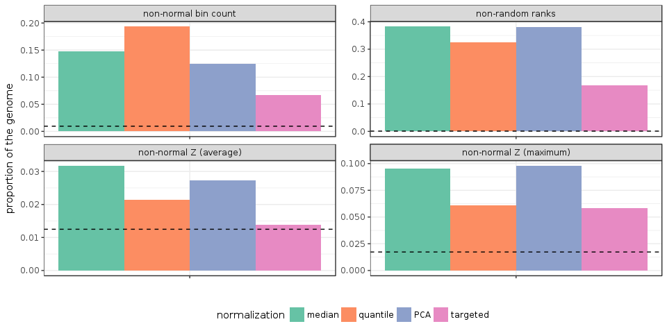
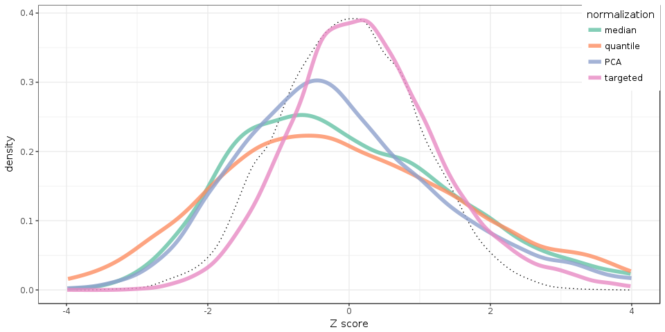

PopSV - Normalization benchmark
===============================

Load packages, functions and data
---------------------------------

``` r
library(dplyr)
library(magrittr)
library(ggplot2)
library(tidyr)
library(PopSV)
NB.CORES = 3

bc.df = read.table("../data/cagekid-5kbp-bc-gcCor.tsv.bgz", as.is = TRUE, sep = "\t", 
    header = TRUE)
```

Median normalization
--------------------

``` r
bc.med = med.norm(bc.df, norm.stats.comp = FALSE, nb.cores = NB.CORES)$bc.norm
qc.med = normQC(bc.med, 10000, nb.cores = NB.CORES)
```

Quantile normalization
----------------------

``` r
bc.qn = quant.norm(bc.med, norm.stats.comp = FALSE, nb.cores = NB.CORES)$bc.norm
qc.qn = normQC(bc.qn, 10000, nb.cores = NB.CORES)
```

PC normalization
----------------

``` r
bc.pc = pca.norm(bc.med, norm.stats.comp = FALSE, nb.cores = NB.CORES)$bc.norm
qc.pc = normQC(bc.pc, 10000, nb.cores = NB.CORES)
```

Control : Simulated normal
--------------------------

``` r
samples = setdiff(colnames(bc.med), c("chr", "start", "end"))
bc.mean = mean(as.numeric(as.matrix(bc.med[, samples])), na.rm = TRUE)
bc.sd = sd(as.numeric(as.matrix(bc.med[, samples])), na.rm = TRUE)
bc.sim = cbind(bc.med[, c("chr", "start", "end")], matrix(rnorm(nrow(bc.med) * 
    length(samples), bc.mean, bc.sd), nrow(bc.med)))
qc.sim = normQC(bc.sim, 10000, nb.cores = NB.CORES)
```

Targeted Normalization
----------------------

``` r
bc.tn = read.table("../data/cagekid-5kbp-bc-gcCor-targetedNorm.tsv.bgz", as.is = TRUE, 
    sep = "\t", header = TRUE)
qc.tn = normQC(bc.tn, 10000, nb.cores = NB.CORES)
```

Format and graph
----------------

``` r
pdf = list(median = qc.med[1:4], quantile = qc.qn[1:4], PCA = qc.pc[1:4], targeted = qc.tn[1:4], 
    simulated = qc.sim[1:4])
pdf = lapply(names(pdf), function(norm) data.frame(norm = norm, pdf[[norm]]))
pdf = do.call(rbind, pdf)
pdf$norm = factor(pdf$norm, levels = unique(pdf$norm))
pdf.m = gather(pdf, "metric", "value", 2:5)
pdf.m$metric = factor(pdf.m$metric, levels = c("prop.nonNorm.bin", "prop.nonRand.rank", 
    "prop.nonNorm.z.mean", "prop.nonNorm.z.max"))
namesForPlot = c(prop.nonNorm.bin = "non-normal bin count", prop.nonRand.rank = "non-random ranks", 
    prop.nonNorm.z.mean = "non-normal Z (average)", prop.nonNorm.z.max = "non-normal Z (maximum)")
levels(pdf.m$metric) = namesForPlot[levels(pdf.m$metric)]

ggplot(subset(pdf.m, norm != "simulated"), aes(x = metric, y = value, fill = norm)) + 
    ggplot2::geom_bar(stat = "identity", position = "dodge") + theme_bw() + 
    scale_fill_brewer(name = "normalization", palette = "Set2") + geom_hline(aes(yintercept = value), 
    data = subset(pdf.m, norm == "simulated"), linetype = 2) + facet_wrap(~metric, 
    scales = "free") + theme(legend.position = "bottom", axis.text.x = element_blank()) + 
    xlab("") + ylab("proportion of the genome")
```



Worst Z distribution for each method
------------------------------------

``` r
worst.z = list(median = qc.med$z.worst.dens, quantile = qc.qn$z.worst.dens, 
    PCA = qc.pc$z.worst.dens, targeted = qc.tn$z.worst.dens, simulated = qc.sim$z.worst.dens)
worst.z = lapply(names(worst.z), function(norm) data.frame(norm = norm, worst.z[[norm]]))
worst.z = do.call(rbind, worst.z)

ggplot(subset(worst.z, norm != "simulated"), aes(x = z, y = density)) + geom_line(data = subset(worst.z, 
    norm == "simulated"), linetype = 3) + geom_line(aes(colour = norm), alpha = 0.8, 
    size = 2) + theme_bw() + scale_colour_brewer(name = "normalization", palette = "Set2") + 
    theme(legend.position = c(1, 1), legend.justification = c(1, 1)) + xlab("Z score") + 
    ggplot2::xlim(-4, 4)
```


