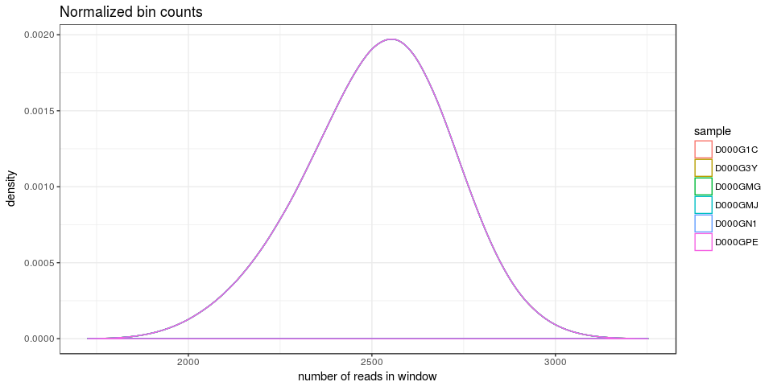
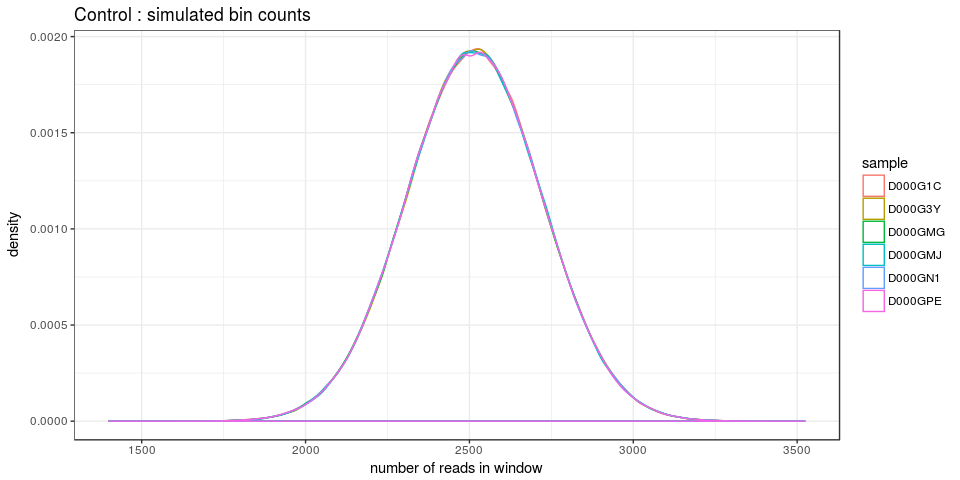
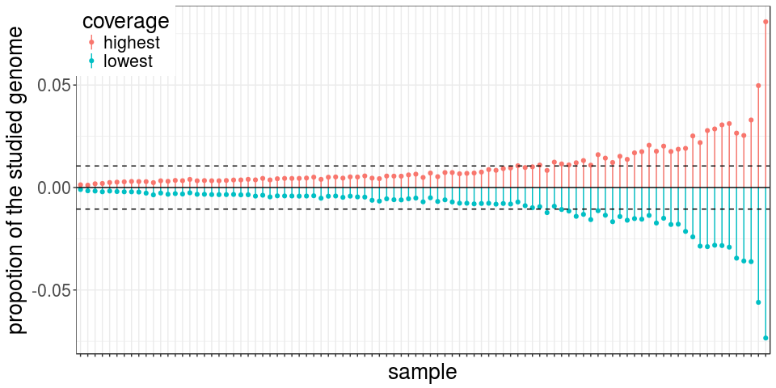
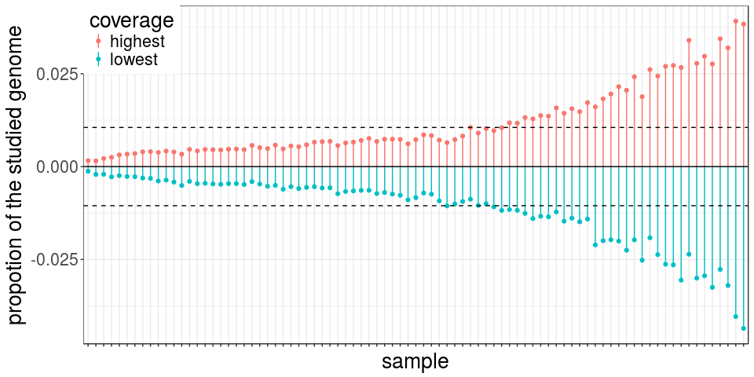

CageKid - Bias in Whole-Genome Sequencing Coverage
==================================================

Load packages, functions and data
---------------------------------

``` r
library(dplyr)
library(magrittr)
library(ggplot2)
library(tidyr)

plot.bc <- function(df, sample.names, max.quant = 0.99, log10 = FALSE) {
    df.tp = df[, sample.names]
    df.tp = gather(df.tp, "sample", "coverage")
    max.bc = quantile(df.tp$coverage, probs = max.quant, na.rm = TRUE)
    gp = ggplot(df.tp, aes(x = coverage)) + geom_density(aes(colour = sample)) + 
        xlab("number of reads in window") + theme_bw() + ggplot2::xlim(min(df.tp$coverage, 
        na.rm = TRUE), max.bc) + scale_colour_hue(name = "sample")
    if (log10) 
        gp = gp + scale_x_log10()
    gp
}

bc.df = read.table("../data/cagekid-5kbp-bc-gcCor.tsv.bgz", as.is = TRUE, sep = "\t", 
    header = TRUE)
samples = colnames(bc.df)[-(1:3)]
sub.samples = sample(samples, 6)
```

Remove bins with extreme coverage in a sample
---------------------------------------------

``` r
sdOutlier <- function(vec, sd.cutoff = 3) {
    abs(vec - median(vec, na.rm = TRUE)) > sd.cutoff * mad(vec, na.rm = TRUE)
}
bins.sd.ol = apply(bc.df[, samples], 2, sdOutlier, sd.cutoff = 3)
bc.df = bc.df[which(!apply(bins.sd.ol, 1, any)), ]
```

Global normalization : Quantile Normalization
---------------------------------------------

``` r
normQN <- function(df, sample.names) {
    rownames(df) = NULL
    quant.o = apply(apply(df[, sample.names], 2, sort, na.last = TRUE), 1, mean, 
        na.rm = TRUE)
    df[, sample.names] = apply(df[, sample.names], 2, function(ee) quant.o[rank(ee)])
    df
}
bc.norm = normQN(bc.df, samples)
plot.bc(bc.norm, sub.samples, 1) + ggtitle("Normalized bin counts")
```



Controls: simulated and permuted coverage
-----------------------------------------

``` r
sim.data <- function(df, sample.names) {
    for (samp in sample.names) {
        df[, samp] = rnorm(nrow(df), mean(df[, samp], na.rm = TRUE), sd(df[, 
            samp], na.rm = TRUE))
    }
    df
}
shuffle.data <- function(df, sample.names) {
    for (samp in sample.names) {
        df[, samp] = sample(df[, samp])
    }
    df
}
bc.norm.sim = sim.data(bc.norm, samples)
bc.norm.shuf = shuffle.data(bc.norm, samples)

plot.bc(bc.norm.sim, sub.samples, 1) + ggtitle("Control : simulated bin counts")
```



``` r
plot.bc(bc.norm.shuf, sub.samples, 1) + ggtitle("Control : shuffled bin counts")
```


Region-specific bias remains after global normalization
-------------------------------------------------------

``` r
interSampleVariation <- function(df, sample.names) {
    df.s = df[, sample.names]
    sd.s = apply(df.s, 1, function(r) c(sd(r, na.rm = TRUE), mean(r, na.rm = TRUE)))
    return(data.frame(df[, c("chr", "start", "end")], sd.inter.samp = sd.s[1, 
        ], mean.inter.samp = sd.s[2, ]))
}
var.is = rbind(data.frame(set = "WGS", interSampleVariation(bc.norm, samples)), 
    data.frame(set = "simulated", interSampleVariation(bc.norm.sim, samples)), 
    data.frame(set = "shuffled", interSampleVariation(bc.norm.shuf, samples)))
var.is = subset(var.is, !is.na(sd.inter.samp))

ggplot(var.is, aes(x = set, y = mean.inter.samp)) + geom_violin(aes(fill = set), 
    scale = "width") + ylab("bin inter-sample mean coverage") + theme_bw() + 
    theme(text = element_text(size = 20)) + guides(fill = FALSE) + coord_flip() + 
    xlab("")
```


``` r
ggplot(var.is, aes(x = set, y = sd.inter.samp)) + geom_violin(aes(fill = set), 
    scale = "width") + ylab("bin inter-sample standard deviation") + theme_bw() + 
    theme(text = element_text(size = 20)) + guides(fill = FALSE) + coord_flip() + 
    xlab("")
```


Sample-specific bias remains after global normalization
-------------------------------------------------------

``` r
rankExtremes <- function(df, samples) {
    id.ex = apply(df[, samples], 1, order)
    max.t = table(id.ex[length(samples), ])
    min.t = table(id.ex[1, ])
    res = data.frame(sample = samples, highest = 0, lowest = 0)
    res$highest[as.numeric(names(max.t))] = as.numeric(max.t)
    res$lowest[as.numeric(names(min.t))] = as.numeric(min.t)
    res
}
rk.df = rbind(data.frame(set = "WGS", rankExtremes(bc.norm, samples)), data.frame(set = "simulated", 
    rankExtremes(bc.norm.sim, samples)), data.frame(set = "shuffled", rankExtremes(bc.norm.shuf, 
    samples)))

rk.m = gather(rk.df, "coverage", "nb.bin", 3:4)
rk.m = rk.m %>% group_by(set, coverage) %>% mutate(prop.bin = nb.bin/sum(nb.bin))
samp.o = rk.m %>% filter(set == "WGS") %>% group_by(sample) %>% summarize(prop.bin = sum(prop.bin)) %>% 
    arrange(prop.bin)
rk.m$sample = factor(rk.m$sample, levels = as.character(samp.o$sample))
rk.m$prop.bin = ifelse(rk.m$coverage == "highest", 1, -1) * rk.m$prop.bin

ggplot(subset(rk.m, set == "WGS"), aes(x = sample, colour = coverage)) + geom_point(aes(y = prop.bin)) + 
    geom_linerange(aes(ymin = 0, ymax = prop.bin)) + theme_bw() + xlab("sample") + 
    geom_hline(yintercept = c(0, 1/length(samples), -1/length(samples)), linetype = c(1, 
        2, 2)) + ylab("propotion of the studied genome") + scale_fill_hue(name = "coverage") + 
    theme(text = element_text(size = 20), legend.position = c(0, 1), legend.justification = c(0, 
        1), axis.text.x = element_blank())
```



``` r
ggplot(subset(rk.m, set != "WGS"), aes(x = sample, colour = coverage)) + geom_point(aes(y = prop.bin)) + 
    geom_linerange(aes(ymin = 0, ymax = prop.bin)) + theme_bw() + xlab("sample") + 
    ylab("propotion of the studied genome") + scale_fill_hue(name = "coverage") + 
    theme(text = element_text(size = 20), axis.text.x = element_blank(), legend.position = "bottom") + 
    facet_grid(set ~ .) + geom_hline(yintercept = c(0, 1/length(samples), -1/length(samples)), 
    linetype = rep(c(1, 2, 2), 2))
```


### Removing the 10 most affected samples

``` r
samples2 = as.character(head(samp.o$sample, nrow(samp.o) - 10))
rk2.df = rbind(data.frame(set = "WGS", rankExtremes(bc.norm, samples2)), data.frame(set = "simulated", 
    rankExtremes(bc.norm.sim, samples2)), data.frame(set = "shuffled", rankExtremes(bc.norm.shuf, 
    samples2)))

rk2.m = gather(rk2.df, "coverage", "nb.bin", 3:4)
rk2.m = rk2.m %>% group_by(set, coverage) %>% mutate(prop.bin = nb.bin/sum(nb.bin))
samp.o = rk2.m %>% filter(set == "WGS") %>% group_by(sample) %>% summarize(prop.bin = sum(prop.bin)) %>% 
    arrange(prop.bin)
rk2.m$sample = factor(rk2.m$sample, levels = as.character(samp.o$sample))
rk2.m$prop.bin = ifelse(rk2.m$coverage == "highest", 1, -1) * rk2.m$prop.bin

ggplot(subset(rk2.m, set == "WGS"), aes(x = sample, colour = coverage)) + geom_point(aes(y = prop.bin)) + 
    geom_linerange(aes(ymin = 0, ymax = prop.bin)) + theme_bw() + xlab("sample") + 
    geom_hline(yintercept = c(0, 1/length(samples), -1/length(samples)), linetype = c(1, 
        2, 2)) + ylab("propotion of the studied genome") + scale_fill_hue(name = "coverage") + 
    theme(text = element_text(size = 20), legend.position = c(0, 1), legend.justification = c(0, 
        1), axis.text.x = element_blank())
```



``` r
ggplot(subset(rk2.m, set != "WGS"), aes(x = sample, colour = coverage)) + ggplot2::geom_point(aes(y = prop.bin)) + 
    geom_linerange(aes(ymin = 0, ymax = prop.bin)) + theme_bw() + xlab("sample") + 
    geom_hline(yintercept = c(0, 1/length(samples), -1/length(samples)), linetype = rep(c(1, 
        2, 2), 2)) + ylab("propotion of the studied genome") + scale_fill_hue(name = "coverage") + 
    theme(text = element_text(size = 20), axis.text.x = element_blank(), legend.position = "bottom") + 
    facet_grid(set ~ .)
```


