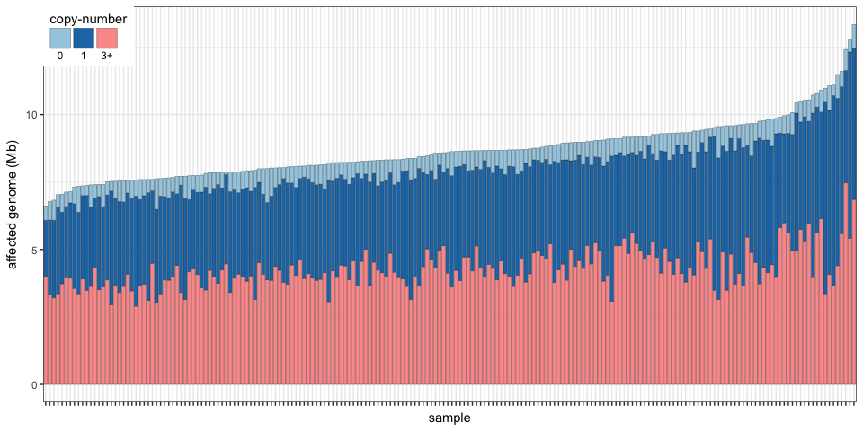
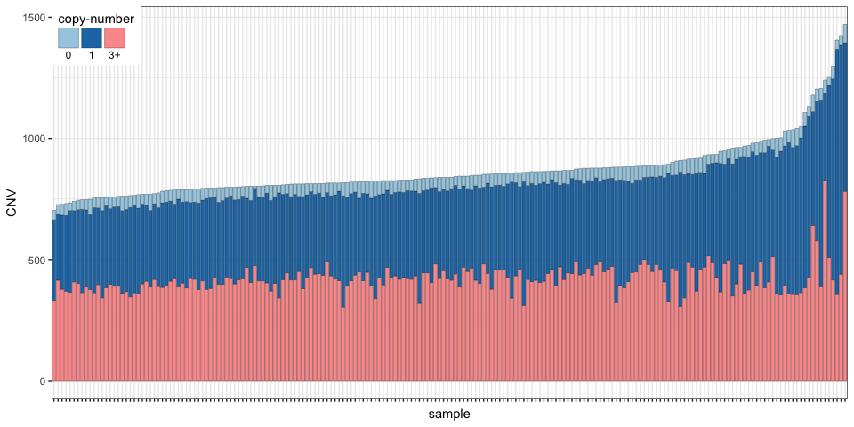

CNVs in epilepsy
================

Load packages, functions and data
---------------------------------

``` r
library(knitr)
library(PopSV)
library(dplyr)
library(magrittr)
library(ggplot2)
library(RColorBrewer)
library(GenomicRanges)
source("EpiPopSV-scripts.R")

## Load CNVs
cnv.all = read.table("../data/cnvs-PopSV-Epilepsy-198affected-301controls-5kb.tsv.gz", 
    header = TRUE, as.is = TRUE, sep = "\t")
cnv.all = cnv.all %>% mutate(project = ifelse(project == "affected", "epilepsy", 
    "parent"))
```

Number of CNVs per sample
-------------------------

``` r
cnv.epi.s = cnv.all %>% filter(project == "epilepsy") %>% mutate(cn = round(2 * 
    fc), cn = ifelse(cn == 2 & z > 0, 3, cn), cn = ifelse(cn == 2 & z < 0, 1, 
    cn), cn.class = ifelse(cn > 2, "3+", cn), cn.class = factor(cn.class, levels = c("0", 
    "1", "3+"))) %>% group_by(sample, cn.class) %>% summarize(call = n(), mb = sum((end - 
    start)/1e+06))

pal.pairs = brewer.pal(12, "Paired")[c(1:2, 5)]
ggplot(cnv.epi.s, aes(x = reorder(sample, mb, sum), y = mb, fill = cn.class)) + 
    geom_bar(color = "black", size = 0.1, stat = "identity") + theme_bw() + 
    theme(axis.text.x = element_blank(), legend.position = c(0, 1), legend.justification = c(0, 
        1)) + xlab("sample") + ylab("affected genome (Mb)") + scale_fill_manual(name = "copy-number", 
    values = pal.pairs) + guides(fill = guide_legend(nrow = 1, label.position = "bottom", 
    label.hjust = 0.5))
```



``` r
ggplot(cnv.epi.s, aes(x = reorder(sample, call, sum), y = call, fill = cn.class)) + 
    geom_bar(color = "black", size = 0.1, stat = "identity") + theme_bw() + 
    theme(axis.text.x = element_blank(), legend.position = c(0, 1), legend.justification = c(0, 
        1)) + xlab("sample") + ylab("CNV") + scale_fill_manual(name = "copy-number", 
    values = pal.pairs) + guides(fill = guide_legend(nrow = 1, label.position = "bottom", 
    label.hjust = 0.5))
```



``` r
cnv.epi.s %>% group_by(sample) %>% summarize(mb = sum(mb), call = sum(call)) %>% 
    ungroup %>% summarize(mb = mean(mb), call = mean(call)) %>% kable(digits = 2)
```

|    mb|    call|
|-----:|-------:|
|  8.69|  870.16|

CNV catalog and frequency annotation
------------------------------------

``` r
load("../data/SVdatabase.RData")
cat.epi = cnv.all %>% filter(project == "epilepsy") %>% reduceDf %>% dbPropDf(svs.gr)

pal.spec = rev(brewer.pal(6, "Spectral"))
bks = c(0, 0.01, 0.1, 0.25, 0.5, 1)
cat.epi %>% mutate(prop.db = ifelse(prop.db > 1, 1, prop.db)) %>% ggplot(aes(x = sqrt(prop.db), 
    fill = factor(nb.proj.db))) + geom_histogram(color = "black") + theme_bw() + 
    scale_fill_manual(values = pal.spec, name = "public database with overlapping variant") + 
    scale_x_continuous(breaks = sqrt(bks), labels = bks) + xlab("maximum frequency in the public databases") + 
    ylab("CNV") + theme(legend.position = c(1, 1), legend.justification = c(1, 
    1)) + guides(fill = guide_legend(nrow = 1, label.position = "bottom", label.hjust = 0.5))
```


We define as rare a CNV that is seen in less than 1% of the samples in all the databases:

``` r
cat.epi %>% mutate(prop.db = ifelse(prop.db > 1, 1, prop.db), db.class = cut(prop.db, 
    c(-Inf, 0.01, 1), labels = c("rare", "common"))) %>% ggplot(aes(x = sqrt(prop.db), 
    fill = db.class)) + geom_histogram(bins = 24, color = "black") + theme_bw() + 
    scale_fill_brewer(palette = "Set2", name = "") + scale_x_continuous(breaks = sqrt(bks), 
    labels = bks) + xlab("maximum frequency in the public databases") + ylab("CNV") + 
    theme(legend.position = c(1, 1), legend.justification = c(1, 1))
```


Regions with rare CNVs
----------------------

Focusing on rare CNVs, how many regions have a homozygous/heterozygous deletions or duplications ?

``` r
cnv.all$prop.db = cnv.all %>% makeGRangesFromDataFrame(keep.extra.columns = TRUE) %>% 
    dbProp(svs.gr)
cnv.all %<>% group_by(project) %>% do(freq.range(., annotate.only = TRUE)) %>% 
    ungroup
cnv.sum = cnv.all %>% filter(project == "epilepsy") %>% mutate(cn.class = cut(fc, 
    breaks = c(0, 0.25, 1, Inf), labels = c(0, 1, ">=3"), include.lowest = TRUE))

sum.all = cnv.sum %>% filter(prop.db < 0.01) %>% mutate(cn.class = "all") %>% 
    group_by(cn.class) %>% summarize(region = round(sum(1/nb)), prop.all.region = 1)
sum.cn = cnv.sum %>% filter(prop.db < 0.01) %>% group_by(cn.class) %>% do(freq.range(., 
    annotate.only = TRUE)) %>% summarize(region = round(sum(1/nb))) %>% mutate(prop.all.region = region/sum.all$region)
sum.cn = rbind(sum.all, sum.cn)

kable(sum.cn, digits = 3)
```

| cn.class |  region|  prop.all.region|
|:---------|-------:|----------------:|
| all      |   12480|            1.000|
| 0        |      21|            0.002|
| 1        |    8022|            0.643|
| &gt;=3   |    4850|            0.389|

CNVs and epilepsy genes
-----------------------

``` r
epilepsy.genes = scan("../data/EpilepsyGenes.txt", "")
load("../data/genomicFeatures.RData")
gene.grl = list(exon = subset(gen.feat.l$exon, geneType == "protein_coding"))
gene.grl$exon.epi = subset(gen.feat.l$exon, geneName %in% epilepsy.genes)
gene.grl = lapply(gene.grl, makeGRangesFromDataFrame, keep.extra.columns = TRUE)

cnv.all.gr = makeGRangesFromDataFrame(cnv.all, keep.extra.columns = TRUE)
cnv.all$exon.d = distanceToNearest(cnv.all.gr, gene.grl$exon) %>% as.data.frame %>% 
    .$distance
cnv.all$exon.epi.d = distanceToNearest(cnv.all.gr, gene.grl$exon.epi) %>% as.data.frame %>% 
    .$distance


summaryEpi <- function(df) {
    dc = cut(df$exon.epi.d, c(-Inf, 0, 10000, 1e+05, Inf), labels = c("exonic", 
        "0-10kb", "10kb-100kb", "non-epilepsy"))
    data.frame(d = factor(c("exonic", "0-10kb", "10kb-100kb"), levels = c("exonic", 
        "0-10kb", "10kb-100kb")), cnv = sapply(1:3, function(x) sum(as.numeric(dc) == 
        x)))
}
summaryExon <- function(df) {
    dc = cut(df$exon.d, c(-Inf, 0, 10000, 1e+05, Inf), labels = c("exonic", 
        "0-10kb", "10kb-100kb", "non-epilepsy"))
    data.frame(d = factor(c("exonic", "0-10kb", "10kb-100kb"), levels = c("exonic", 
        "0-10kb", "10kb-100kb")), cnv = sapply(1:3, function(x) sum(as.numeric(dc) == 
        x)))
}

sum.epi = rbind(cnv.all %>% filter(project == "epilepsy", prop.db < 0.01) %>% 
    group_by(sample) %>% do(summaryEpi(.)) %>% group_by(sample) %>% arrange(d) %>% 
    mutate(c1 = cnv[1], c2 = cnv[2], c3 = cnv[3]) %>% ungroup %>% arrange(desc(c1), 
    desc(c2), desc(c3)) %>% mutate(gene = "epilepsy genes", sample = factor(sample, 
    levels = unique(sample))), cnv.all %>% filter(project == "epilepsy", prop.db < 
    0.01) %>% group_by(sample) %>% do(summaryExon(.)) %>% group_by(sample) %>% 
    arrange(d) %>% mutate(c1 = cnv[1], c2 = cnv[2], c3 = cnv[3]) %>% ungroup %>% 
    arrange(desc(c1), desc(c2), desc(c3)) %>% mutate(gene = "all genes", sample = factor(sample, 
    levels = unique(sample))))


ggplot(sum.epi, aes(x = sample, y = cnv, fill = d)) + geom_bar(stat = "identity", 
    color = "black", size = 0.1) + theme_bw() + theme(axis.text.x = element_blank(), 
    legend.position = c(1, 0.2), legend.justification = c(1, 0.2)) + xlab("sample") + 
    ylab("rare CNV") + scale_fill_brewer(name = "distance to closest exon", 
    palette = "Spectral") + facet_grid(gene ~ ., scales = "free") + guides(fill = guide_legend(nrow = 1, 
    label.position = "right", label.hjust = 0.5))
```


