CNV enrichment patterns in epilepsy
===================================

Load packages, functions and data
---------------------------------

``` r
library(knitr)
library(RColorBrewer)
library(PopSV)
library(dplyr)
library(magrittr)
library(ggplot2)
library(GenomicRanges)
library(parallel)
source("EpiPopSV-scripts.R")

## Load genomic annotations
load("../data/SVdatabase.RData")
load("../data/genomicFeatures.RData")
## geneId -> geneName
gg = gen.feat.l$gene %>% select(geneId, geneName) %>% unique
geneidToGenename = gg$geneName
names(geneidToGenename) = gg$geneId
## Exons
exons.grl = list(exon = subset(gen.feat.l$exon, geneType == "protein_coding"))
## ExAC lof intolerant
exac = read.csv("../data/fordist_cleaned_exac_r03_march16_z_pli_rec_null_data.txt", 
    as.is = TRUE, sep = "\t")
gene.intolerant = subset(exac, pLI > 0.9)$gene
exons.grl$exon.pli = subset(gen.feat.l$exon, geneName %in% gene.intolerant)
## Epilepsy genes
epilepsy.genes = scan("../data/EpilepsyGenes.txt", "a", quiet = TRUE)
exons.grl$exon.epi = subset(gen.feat.l$exon, geneName %in% epilepsy.genes)
## Convert to GRanges
exons.grl = lapply(exons.grl, makeGRangesFromDataFrame, keep.extra.columns = TRUE)
## Enhancer map
load("../data/enhancerMap.RData")
eqtl.epi = subset(eqtl, gene_id %in% unique(exons.grl$exon.epi$geneId))
eqtl.epi$gene = geneidToGenename[eqtl.epi$gene_id]
seqlevels(dnaseMap) = gsub("chr", "", seqlevels(dnaseMap))
dnaseMap.epi = subset(dnaseMap, gene %in% epilepsy.genes)
## Load and annotate CNVs
cnv.all = read.table("../data/cnvs-PopSV-Epilepsy-198affected-301controls-5kb.tsv.gz", 
    header = TRUE, as.is = TRUE, sep = "\t")
cnv.all = cnv.all %>% mutate(project = ifelse(project == "affected", "patients", 
    "controls"))
cnv.all.gr = makeGRangesFromDataFrame(cnv.all, keep.extra.columns = TRUE)
cnv.all$prop.db = dbProp(cnv.all.gr, svs.gr)
cnv.all$prop.db.50 = cnv.all.gr %>% dbProp(., svs.gr, min.db.span = 0.5)  # 50% overlap
cnv.all$exon = overlapsAny(cnv.all.gr, exons.grl$exon)
epi.gr = reduce(subset(cnv.all.gr, project == "patients"))
cnv.all$exon.epi = overlapsAny(cnv.all.gr, exons.grl$exon.epi)
cnv.all$enhancer.epi = overlapsAny(cnv.all.gr, dnaseMap.epi) | overlapsAny(cnv.all.gr, 
    eqtl.epi)
epid = distanceToNearest(cnv.all.gr, exons.grl$exon.epi) %>% as.data.frame
cnv.all$exon.epi.d = Inf
cnv.all$exon.epi.d[epid$queryHits] = epid$distance
cnv.all$exon.epi.closest = NA
cnv.all$exon.epi.closest[epid$queryHits] = exons.grl$exon.epi$geneName[epid$subjectHits]
cnv.all %<>% group_by(project) %>% do(freq.range(., annotate.only = TRUE)) %>% 
    ungroup
info.df = cnv.all %>% select(sample, project) %>% unique
```

Also let's choose how many cores we want to use:

``` r
NB.CORES = 3
```

Exonic enrichment
-----------------

### Preliminary analysis: Large CNVs enriched in exons in patients

We first recover the previously described enrichment of large-rare exonic CNVs in patients compared to controls.

``` r
permF <- function(rr, cnv.df, feat.grl) {
    info.df %<>% group_by(project) %>% filter(sample %in% sample(unique(sample), 
        150))
    cat.all = cnv.df %>% filter(sample %in% info.df$sample) %>% group_by(project) %>% 
        do(reduceDf(.)) %>% mutate(sample = project, control = FALSE) %>% makeGRangesFromDataFrame(keep.extra.columns = TRUE)
    cat.null = draw.controls(cat.all, list(centel = gen.feat.l$centel), nb.cores = 1)
    cat.null$project = cat.null$sample
    cat.null$sample = cat.all$sample = NULL
    cat.null$control = TRUE
    cat.all = c(cat.all, cat.null)
    res = lapply(1:length(feat.grl), function(ii) {
        cat.all$ol = overlapsAny(cat.all, feat.grl[[ii]])
        obs = mcols(cat.all) %>% as.data.frame %>% group_by(control, project) %>% 
            summarize(nb = sum(ol), prop = (1 + nb)/(1 + n())) %>% mutate(feat = names(feat.grl)[ii], 
            rep = rr, set = "obs")
        exp = mcols(cat.all) %>% as.data.frame %>% mutate(project = sample(project)) %>% 
            group_by(control, project) %>% summarize(nb = sum(ol), prop = (1 + 
            nb)/(1 + n())) %>% mutate(feat = names(feat.grl)[ii], rep = rr, 
            set = "exp")
        rbind(obs, exp)
    })
    do.call(rbind, res)
}

exons.all.pli = exons.grl
exons.all.pli$exon.epi = NULL
enr.large.all = do.call(rbind, mclapply(1:100, permF, cnv.df = subset(cnv.all, 
    end - start > 50000), feat.grl = exons.all.pli, mc.cores = NB.CORES))
enr.large.rare = do.call(rbind, mclapply(1:100, permF, cnv.df = subset(cnv.all, 
    end - start > 50000 & prop.db.50 < 0.01), feat.grl = exons.all.pli, mc.cores = NB.CORES))
enr.large.all.ss = enr.large.all %>% filter(set == "obs") %>% group_by(feat, 
    project, rep) %>% summarize(enr = prop[!control]/prop[control]) %>% mutate(set = "all CNVs")
enr.large.rare.ss = enr.large.rare %>% filter(set == "obs") %>% group_by(feat, 
    project, rep) %>% summarize(enr = prop[!control]/prop[control]) %>% mutate(set = "rare CNVs")
enr.large.s = rbind(enr.large.all.ss, enr.large.rare.ss)

ggplot(enr.large.s, aes(x = feat, fill = project, y = winsorF(enr, 2))) + geom_boxplot(notch = TRUE) + 
    theme_bw() + xlab("") + ylab("fold-enrichment") + scale_x_discrete(breaks = c("exon", 
    "exon.pli"), labels = c("all genes", "LoF\nintolerant\ngenes")) + facet_grid(. ~ 
    set) + geom_hline(yintercept = 1, linetype = 2) + scale_fill_brewer(name = "", 
    palette = "Set1")
```

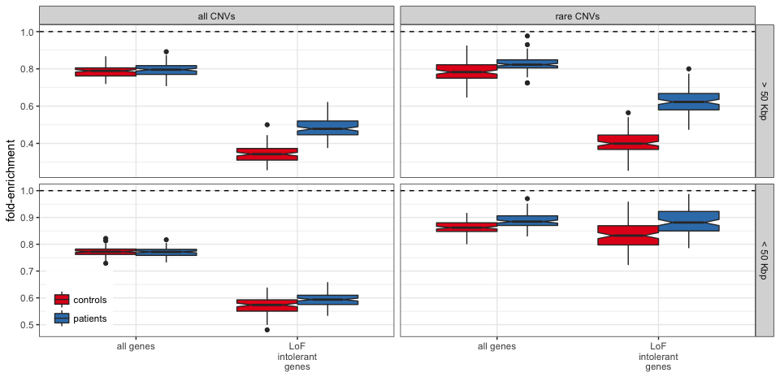

### Sub-sampling and permutation

Now using all the calls (mostly small CNVs), do we see the same exonic enrichment ?

NOTE: This is 20 times less sub-sampling and permutations than in the paper, hence the signal might not be as clean. It might take more time but feel free to increase `NB.SUBSAMP` and `NB.PERMS`.

``` r
NB.SUBSAMP = 100
NB.PERMS = 20
enr.all = do.call(rbind, mclapply(1:(NB.SUBSAMP * NB.PERMS), permF, cnv.df = cnv.all, 
    feat.grl = exons.all.pli, mc.cores = NB.CORES))
enr.rare = do.call(rbind, mclapply(1:(NB.SUBSAMP * NB.PERMS), permF, cnv.df = subset(cnv.all, 
    prop.db < 0.01), feat.grl = exons.all.pli, mc.cores = NB.CORES))
```

### Graphs for a batch of sub-sampling

``` r
enr.all.ss = enr.all %>% filter(set == "obs", rep <= NB.SUBSAMP) %>% group_by(feat, 
    project, rep) %>% summarize(enr = prop[!control]/prop[control]) %>% mutate(set = "all CNVs")
enr.rare.ss = enr.rare %>% filter(set == "obs", rep <= NB.SUBSAMP) %>% group_by(feat, 
    project, rep) %>% summarize(enr = prop[!control]/prop[control]) %>% mutate(set = "rare CNVs")
enr.s = rbind(enr.all.ss, enr.rare.ss)

ggplot(enr.s, aes(x = feat, fill = project, y = enr)) + geom_boxplot() + theme_bw() + 
    xlab("") + ylab("fold-enrichment") + scale_x_discrete(breaks = c("exon", 
    "exon.pli"), labels = c("all genes", "LoF\nintolerant\ngenes")) + facet_grid(. ~ 
    set) + geom_hline(yintercept = 1, linetype = 2) + scale_fill_brewer(name = "", 
    palette = "Set1")
```

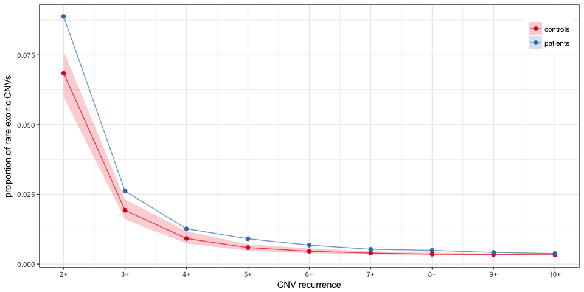

### Permutation test

It takes time to draw the control regions for each sub-sampling, hence the number of sub-sampling and permutation has been decreased in this report. For the paper high performance computing was used to run a thousand times a hundred sub-sampling.

``` r
enr.all.ss.med = enr.all.ss %>% group_by(feat, project) %>% summarize(enr.med = median(enr))
enr.all %>% filter(set == "exp") %>% mutate(batch = cut(rep, NB.PERMS)) %>% 
    group_by(feat, project, rep, batch) %>% summarize(enr = prop[!control]/prop[control]) %>% 
    group_by(project, feat, batch) %>% summarize(enr = median(enr)) %>% merge(enr.all.ss.med) %>% 
    group_by(feat, batch) %>% summarize(epi.enr = enr[project == "patients"] - 
    enr[project != "patients"], epi.med = enr.med[project == "patients"] - enr.med[project != 
    "patients"], epi.enr = epi.enr > epi.med) %>% group_by(feat) %>% summarize(pv = (1 + 
    sum(epi.enr))/(1 + n())) %>% kable
```

| feat     |        pv|
|:---------|---------:|
| exon     |  1.000000|
| exon.pli |  0.047619|

``` r
enr.rare.ss.med = enr.rare.ss %>% group_by(feat, project) %>% summarize(enr.med = median(enr))
enr.rare %>% filter(set == "exp") %>% mutate(batch = cut(rep, NB.PERMS)) %>% 
    group_by(feat, project, rep, batch) %>% summarize(enr = prop[!control]/prop[control]) %>% 
    group_by(project, feat, batch) %>% summarize(enr = median(enr)) %>% merge(enr.rare.ss.med) %>% 
    group_by(feat, batch) %>% summarize(epi.enr = enr[project == "patients"] - 
    enr[project != "patients"], epi.med = enr.med[project == "patients"] - enr.med[project != 
    "patients"], epi.enr = epi.enr > epi.med) %>% group_by(feat) %>% summarize(pv = (1 + 
    sum(epi.enr))/(1 + n())) %>% kable
```

| feat     |        pv|
|:---------|---------:|
| exon     |  0.047619|
| exon.pli |  0.047619|

### Permutation test: a resampling trick

**This is not what was used for the paper**, but rather an approximation of the time-consuming permutations used for the paper.

We can approximate the permuted P-value by resampling the sub-sampling.

``` r
NEW.NB.PERMS = 1000
NEW.NB.SUBSAMP = 100
bootstrapEnr <- function(df, nb.bs, nb.ss) {
    data.frame(batch = 1:nb.bs, enr = sapply(1:nb.bs, function(ii) median(sample(df$enr, 
        nb.ss))))
}

enr.all %>% filter(set == "exp") %>% group_by(feat, project, rep) %>% summarize(enr = prop[!control]/prop[control]) %>% 
    group_by(project, feat) %>% do(bootstrapEnr(., NEW.NB.PERMS, NEW.NB.SUBSAMP)) %>% 
    merge(enr.all.ss.med) %>% group_by(feat, batch) %>% summarize(epi.enr = enr[project == 
    "patients"] - enr[project != "patients"], epi.med = enr.med[project == "patients"] - 
    enr.med[project != "patients"], epi.enr = epi.enr > epi.med) %>% group_by(feat) %>% 
    summarize(pv = (1 + sum(epi.enr))/(1 + n())) %>% kable
```

| feat     |        pv|
|:---------|---------:|
| exon     |  1.000000|
| exon.pli |  0.000999|

``` r
enr.rare %>% filter(set == "exp") %>% group_by(feat, project, rep) %>% summarize(enr = prop[!control]/prop[control]) %>% 
    group_by(project, feat) %>% do(bootstrapEnr(., NEW.NB.PERMS, NEW.NB.SUBSAMP)) %>% 
    merge(enr.rare.ss.med) %>% group_by(feat, batch) %>% summarize(epi.enr = enr[project == 
    "patients"] - enr[project != "patients"], epi.med = enr.med[project == "patients"] - 
    enr.med[project != "patients"], epi.enr = epi.enr > epi.med) %>% group_by(feat) %>% 
    summarize(pv = (1 + sum(epi.enr))/(1 + n())) %>% kable
```

| feat     |        pv|
|:---------|---------:|
| exon     |  0.002997|
| exon.pli |  0.000999|

Rare exonic CNVs are less private in the epilepsy cohort
--------------------------------------------------------

### All epilepsy patients, controls down-sampled

``` r
rare.ex = cnv.all %>% filter(prop.db < 0.01, exon)
rare.ex.f = rare.ex %>% group_by(project) %>% do(freqSS(.))
rare.ex.f %>% group_by(project, nb, rep) %>% summarize(n = n()/nb[1]) %>% group_by(project, 
    rep) %>% arrange(desc(nb)) %>% mutate(cn = cumsum(n), cprop = cn/sum(n)) %>% 
    filter(nb > 1, nb < 11) %>% group_by(project, nb) %>% summarize(cprop.5 = quantile(cprop, 
    probs = 0.05), cprop.95 = quantile(cprop, probs = 0.95), cprop = median(cprop)) %>% 
    ggplot(aes(x = nb, y = cprop, colour = project, fill = project)) + geom_ribbon(aes(ymin = cprop.5, 
    ymax = cprop.95), colour = FALSE, alpha = 0.2) + geom_line(alpha = 0.7) + 
    geom_point(size = 2) + scale_colour_brewer(name = "", palette = "Set1") + 
    scale_fill_brewer(name = "", palette = "Set1") + theme_bw() + scale_x_continuous(breaks = 2:10, 
    labels = paste0(c(2:10), "+")) + xlab("CNV recurrence") + ylab("proportion of rare exonic CNVs")
```

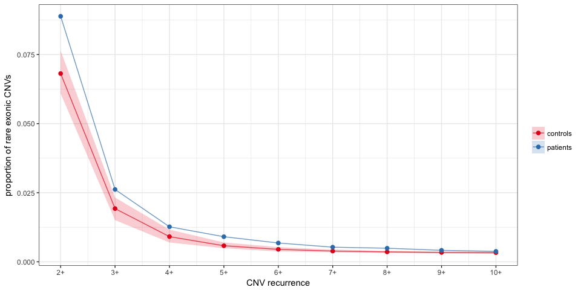

### Same after exteme samples removal

In each cohort, let's remove the top 20 samples with the most rare exonic non-private CNVs.

``` r
rare.epi.samp.o = rare.ex.f %>% filter(nb > 1) %>% group_by(project, sample) %>% 
    summarize(cnv = n()) %>% arrange(desc(cnv)) %>% group_by(project) %>% do(head(., 
    20))
rare.ex.f.noext = rare.ex %>% filter(!(sample %in% rare.epi.samp.o$sample)) %>% 
    group_by(project) %>% do(freqSS(., sample.size = 178))
rare.ex.f.noext %>% group_by(project, nb, rep) %>% summarize(n = n()/nb[1]) %>% 
    group_by(project, rep) %>% arrange(desc(nb)) %>% mutate(cn = cumsum(n), 
    cprop = cn/sum(n)) %>% filter(nb > 1, nb < 11) %>% group_by(project, nb) %>% 
    summarize(cprop.5 = quantile(cprop, probs = 0.05), cprop.95 = quantile(cprop, 
        probs = 0.95), cprop = median(cprop)) %>% ggplot(aes(x = nb, y = cprop, 
    colour = project, fill = project)) + geom_ribbon(aes(ymin = cprop.5, ymax = cprop.95), 
    colour = FALSE, alpha = 0.2) + geom_line(alpha = 0.7) + geom_point(size = 2) + 
    scale_colour_brewer(name = "", palette = "Set1") + scale_fill_brewer(name = "", 
    palette = "Set1") + theme_bw() + scale_x_continuous(breaks = 2:10, labels = paste0(c(2:10), 
    "+")) + xlab("CNV recurrence") + ylab("proportion of rare exonic CNVs") + 
    ggtitle("Top 20 most extreme samples removed")
```

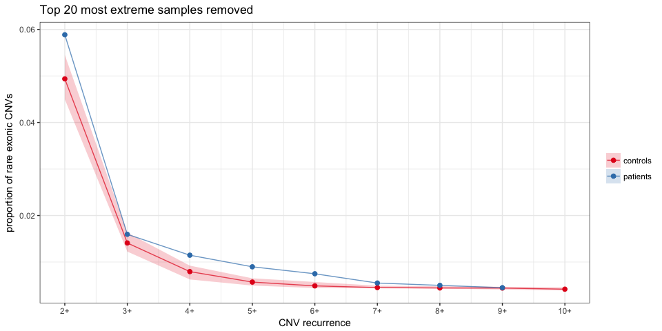

### French-Canadians only

``` r
french.canadians = scan("../data/frenchCanadiansControls.txt", "a", quiet = TRUE)
cnv.fc = cnv.all %>% filter(project == "patients" | sample %in% french.canadians)
fc.ss = cnv.fc %>% select(sample, project) %>% unique %>% group_by(project) %>% 
    summarize(n = n()) %>% .$n %>% unlist %>% min
rare.ex.fc = cnv.fc %>% filter(exon, prop.db < 0.01) %>% group_by(project) %>% 
    do(freqSS(., sample.size = fc.ss))
rare.ex.fc %>% group_by(project, nb, rep) %>% summarize(n = n()/nb[1]) %>% group_by(project, 
    rep) %>% arrange(desc(nb)) %>% mutate(cn = cumsum(n), cprop = cn/sum(n)) %>% 
    filter(nb > 1, nb < 11) %>% group_by(project, nb) %>% summarize(cprop.5 = quantile(cprop, 
    probs = 0.05), cprop.95 = quantile(cprop, probs = 0.95), cprop = median(cprop)) %>% 
    ggplot(aes(x = nb, y = cprop, colour = project, fill = project)) + geom_ribbon(aes(ymin = cprop.5, 
    ymax = cprop.95), colour = FALSE, alpha = 0.2) + geom_line(alpha = 0.7) + 
    geom_point(size = 2) + scale_colour_brewer(name = "", palette = "Set1") + 
    scale_fill_brewer(name = "", palette = "Set1") + theme_bw() + scale_x_continuous(breaks = 2:10, 
    labels = paste0(c(2:10), "+")) + xlab("CNV recurrence") + ylab("proportion of rare exonic CNVs") + 
    ggtitle("French-Canadians only")
```

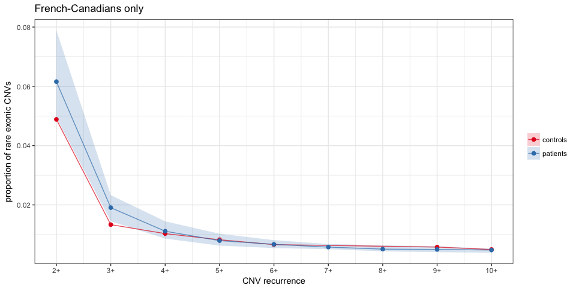

### Permutation test

``` r
diff.obs = rare.ex.f %>% group_by(project, nb) %>% summarize(n = n()/nb[1]) %>% 
    group_by(project) %>% summarize(non.priv = sum(n[nb > 1])/sum(n)) %>% arrange(project) %>% 
    .$non.priv %>% diff
diff.exp = replicate(1000, {
    rare.ex.f %>% ungroup %>% mutate(project = sample(project)) %>% group_by(project, 
        nb) %>% summarize(n = n()/nb[1]) %>% group_by(project) %>% summarize(non.priv = sum(n[nb > 
        1])/sum(n)) %>% arrange(project) %>% .$non.priv %>% diff
})

diff.obs.noext = rare.ex.f.noext %>% group_by(project, nb) %>% summarize(n = n()/nb[1]) %>% 
    group_by(project) %>% summarize(non.priv = sum(n[nb > 1])/sum(n)) %>% arrange(project) %>% 
    .$non.priv %>% diff
diff.exp.noext = replicate(1000, {
    rare.ex.f.noext %>% ungroup %>% mutate(project = sample(project)) %>% group_by(project, 
        nb) %>% summarize(n = n()/nb[1]) %>% group_by(project) %>% summarize(non.priv = sum(n[nb > 
        1])/sum(n)) %>% arrange(project) %>% .$non.priv %>% diff
})

diff.obs.fc = rare.ex.fc %>% group_by(project, nb) %>% summarize(n = n()/nb[1]) %>% 
    group_by(project) %>% summarize(non.priv = sum(n[nb > 1])/sum(n)) %>% arrange(project) %>% 
    .$non.priv %>% diff
diff.exp.fc = replicate(1000, {
    rare.ex.fc %>% ungroup %>% mutate(project = sample(project)) %>% group_by(project, 
        nb) %>% summarize(n = n()/nb[1]) %>% group_by(project) %>% summarize(non.priv = sum(n[nb > 
        1])/sum(n)) %>% arrange(project) %>% .$non.priv %>% diff
})
```

``` r
priv.test = data.frame(test = c("all samples", "top 20 extreme samples removed", 
    "french-canadian"), pv = c((1 + sum(diff.obs <= diff.exp))/(1 + length(diff.exp)), 
    (1 + sum(diff.obs.noext <= diff.exp.noext))/(1 + length(diff.exp.noext)), 
    (1 + sum(diff.obs.fc <= diff.exp.fc))/(1 + length(diff.exp.fc))))
kable(priv.test)
```

| test                           |        pv|
|:-------------------------------|---------:|
| all samples                    |  0.000999|
| top 20 extreme samples removed |  0.002997|
| french-canadian                |  0.002997|

Non-coding rare CNVs
--------------------

``` r
freqEpiRareSS <- function(df, sample.size = 198, nb.rep = 100) {
    if (length(unique(df$sample)) > sample.size) {
        res = mclapply(1:nb.rep, function(ii) {
            df %>% filter(sample %in% sample(unique(sample), sample.size)) %>% 
                filter(exon.epi.d < 3e+06) %>% do(freq.range(., annotate.only = TRUE)) %>% 
                filter(exon.epi.d < 4e+05, prop.db < 0.01) %>% mutate(rep = ii) %>% 
                as.data.frame
        }, mc.cores = NB.CORES)
        return(do.call(rbind, res))
    } else {
        return(df %>% freq.range(annotate.only = TRUE) %>% filter(exon.epi.d < 
            4e+05, prop.db < 0.01) %>% mutate(rep = 1))
    }
}
cnv.ss = cnv.all %>% group_by(project) %>% do(freqEpiRareSS(., nb.rep = 100))
```

### All rare non-coding CNVs

``` r
cnb.nc = cnv.ss %>% filter(prop.db < 0.01, nb < 10, !exon) %>% group_by(project, 
    rep) %>% arrange(exon.epi.d) %>% filter(!duplicated(sample)) %>% do(decdf(., 
    "exon.epi.d")) %>% group_by(project, d) %>% summarize(cnb.5 = quantile(cnb, 
    probs = 0.05), cnb.95 = quantile(cnb, probs = 0.95), cnb = median(cnb))
ggplot(subset(cnb.nc, d < 50000), aes(x = d/1000, y = cnb, colour = project, 
    fill = project)) + geom_line(size = 2) + geom_ribbon(aes(ymax = cnb.95, 
    ymin = cnb.5), alpha = 0.2, linetype = 2, data = subset(cnb.nc, d < 50000 & 
    project == "controls")) + theme_bw() + xlab("distance to nearest epilepsy exon (kb)") + 
    ylab("cumulative affected samples") + scale_fill_brewer(name = "", palette = "Set1") + 
    scale_colour_brewer(name = "", palette = "Set1")
```

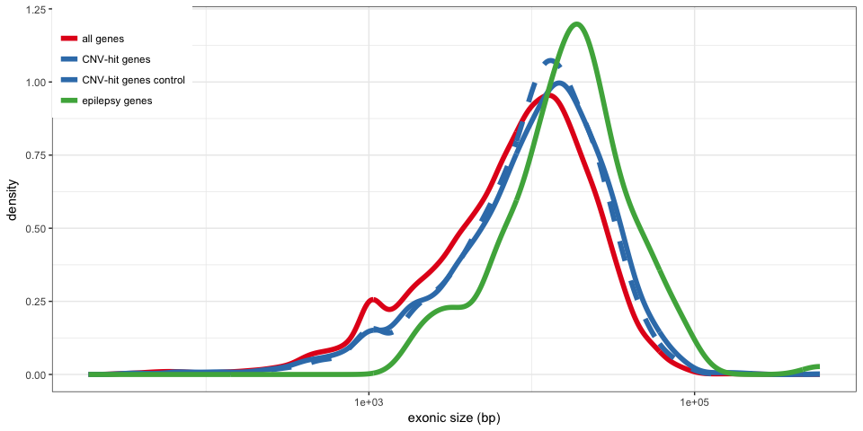

### Rare non-coding CNVs that overlaps functional annotations

Focusing on CNVs that overlaps an eQTL for the epilepsy gene, or a DNase I hypersensitive site associated to the promoter of the epilepsy gene.

``` r
cnb.df = cnv.ss %>% filter(prop.db < 0.01, nb < 10, !exon, enhancer.epi) %>% 
    group_by(project, rep) %>% arrange(exon.epi.d) %>% filter(!duplicated(sample)) %>% 
    do(decdf(., "exon.epi.d")) %>% group_by(project, d) %>% summarize(cnb.5 = quantile(cnb, 
    probs = 0.05), cnb.95 = quantile(cnb, probs = 0.95), cnb = median(cnb))
ggplot(cnb.df, aes(x = d/1000, y = cnb, colour = project, fill = project)) + 
    geom_line(size = 2) + geom_ribbon(aes(ymax = cnb.95, ymin = cnb.5), alpha = 0.2, 
    linetype = 2, data = subset(cnb.df, project == "controls")) + theme_bw() + 
    xlab("distance to nearest epilepsy exon (kb)") + ylab("cumulative affected samples") + 
    scale_fill_brewer(name = "", palette = "Set1") + scale_colour_brewer(name = "", 
    palette = "Set1")
```

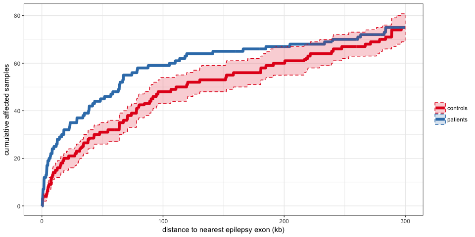

``` r
cnb.rec = cnv.ss %>% filter(prop.db < 0.01, nb > 1, nb < 10, !exon, enhancer.epi) %>% 
    group_by(project, rep) %>% arrange(exon.epi.d) %>% filter(!duplicated(sample)) %>% 
    do(decdf(., "exon.epi.d")) %>% group_by(project, d) %>% summarize(cnb.5 = quantile(cnb, 
    probs = 0.05), cnb.95 = quantile(cnb, probs = 0.95), cnb = median(cnb))
ggplot(cnb.rec, aes(x = d/1000, y = cnb, colour = project, fill = project)) + 
    geom_line(size = 2) + geom_ribbon(aes(ymax = cnb.95, ymin = cnb.5), alpha = 0.2, 
    linetype = 2, data = subset(cnb.rec, project == "controls")) + theme_bw() + 
    xlab("distance to nearest epilepsy exon (kb)") + ylab("cumulative affected samples") + 
    ggtitle("Non-private") + scale_fill_brewer(name = "", palette = "Set1") + 
    scale_colour_brewer(name = "", palette = "Set1")
```

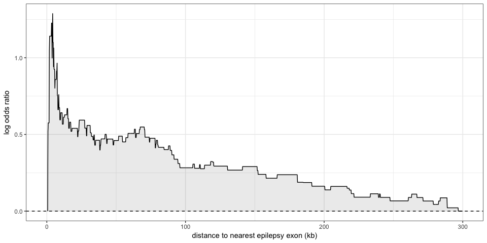

Rare CNVs hitting epilepsy genes
--------------------------------

### Controlling for the gene size

Epilepsy genes tend to be large, and larger genes are more likely hit by variants (including CNVs). We can select genes with similar gene size in order to control for the size effect. We check that in the distribution of gene size are satisfactory.

``` r
exon.cnv.genes = cnv.all %>% filter(project == "patients") %>% makeGRangesFromDataFrame(keep.extra.columns = TRUE) %>% 
    subsetByOverlaps(exons.grl$exon, .) %>% mcols %>% .$geneName %>% unique
gene.sum = exons.grl$exon %>% as.data.frame %>% group_by(geneName) %>% summarize(exon.size = sum(end - 
    start), start = min(start), end = max(end), size = end - start, nb.exon = n()) %>% 
    mutate(epilepsy = geneName %in% epilepsy.genes, cnv = geneName %in% exon.cnv.genes)
size.bk = c(quantile(subset(gene.sum, cnv)$size, probs = seq(0, 1, 0.2)), Inf)
gene.sum$size.class = cut(gene.sum$size, size.bk, include.lowest = TRUE)
gene.sum.cnv = subset(gene.sum, cnv)
gene.cont.ii = lapply(levels(gene.sum.cnv$size.class), function(sc) {
    sample(which(gene.sum$size.class == sc), sum(gene.sum.cnv$size.class == 
        sc))
})
gene.cont = gene.sum$geneName[unlist(gene.cont.ii)]
gene.sum.n = rbind(gene.sum %>% mutate(set = "all genes"), gene.sum %>% filter(geneName %in% 
    gene.cont) %>% mutate(set = "CNV-hit genes control"), gene.sum %>% filter(epilepsy) %>% 
    mutate(set = "epilepsy genes"), gene.sum %>% filter(cnv) %>% mutate(set = "CNV-hit genes"))

colpal = brewer.pal(3, "Set1")[c(1, 2, 2, 3)]
ggplot(gene.sum.n, aes(x = size, colour = set, linetype = set)) + stat_density(size = 2, 
    geom = "line", position = "dodge") + theme_bw() + scale_x_log10() + scale_linetype_manual(values = c(1, 
    1, 2, 1), name = "") + scale_colour_manual(values = colpal, name = "") + 
    ylab("density") + xlab("gene size (bp)") + theme(legend.position = c(0, 
    1), legend.justification = c(0, 1))
```

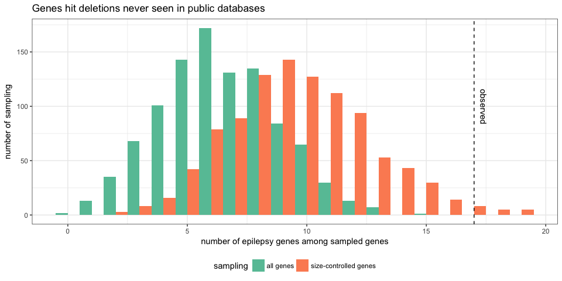

Eventially we can check that the exonic sequence size and number of exons are also controlled by this approach.

``` r
ggplot(gene.sum.n, aes(x = exon.size, colour = set, linetype = set)) + stat_density(size = 2, 
    geom = "line", position = "dodge") + theme_bw() + scale_x_log10() + scale_linetype_manual(values = c(1, 
    1, 2, 1), name = "") + scale_colour_manual(values = colpal, name = "") + 
    ylab("density") + xlab("exonic size (bp)") + theme(legend.position = c(0, 
    1), legend.justification = c(0, 1))
```


``` r
ggplot(gene.sum.n, aes(x = nb.exon, colour = set, linetype = set)) + stat_density(size = 2, 
    geom = "line", position = "dodge") + theme_bw() + scale_x_log10() + scale_linetype_manual(values = c(1, 
    1, 2, 1), name = "") + scale_colour_manual(values = colpal, name = "") + 
    ylab("density") + xlab("number of exons") + theme(legend.position = c(0, 
    1), legend.justification = c(0, 1))
```

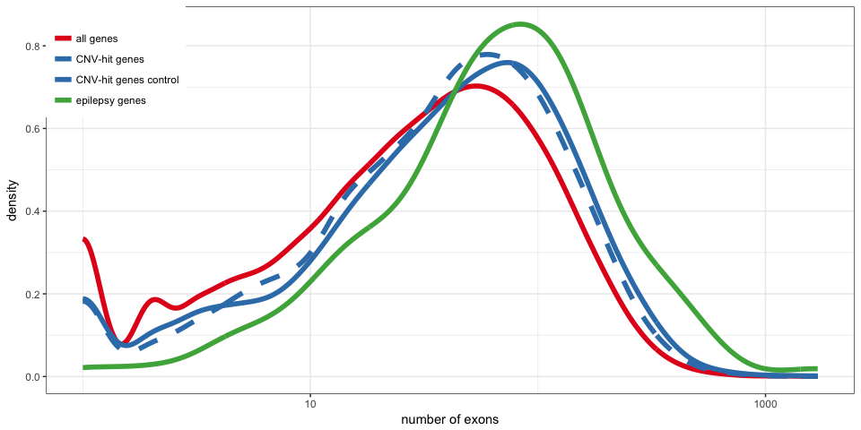

Then the new sampling-based test:

``` r
testGenesCnvs <- function(cnv.df, nb.perm = 1000, nb.class = 5) {
    exon.cnv.genes = cnv.df %>% makeGRangesFromDataFrame(keep.extra.columns = TRUE) %>% 
        subsetByOverlaps(exons.grl$exon, .) %>% mcols %>% .$geneName %>% unique
    gene.sum %<>% mutate(cnv = geneName %in% exon.cnv.genes)
    size.bk = c(quantile(subset(gene.sum, cnv)$size, probs = seq(0, 1, 1/nb.class)), 
        Inf)
    gene.sum$size.class = cut(gene.sum$size, size.bk, include.lowest = TRUE)
    gene.sum.cnv = subset(gene.sum, cnv)
    obs.epi = sum(exon.cnv.genes %in% epilepsy.genes)
    exp.epi.size = mclapply(1:nb.perm, function(ii) {
        gene.cont.ii = lapply(levels(gene.sum.cnv$size.class), function(sc) {
            sample(which(gene.sum$size.class == sc), sum(gene.sum.cnv$size.class == 
                sc))
        })
        gene.cont = gene.sum$geneName[unlist(gene.cont.ii)]
        sum(gene.cont %in% epilepsy.genes)
    }, mc.cores = NB.CORES)
    list(exp = unlist(exp.epi.size), obs = obs.epi, sum.df = data.frame(odds.ratio = obs.epi/mean(unlist(exp.epi.size)), 
        gene = nrow(gene.sum.cnv), gene.epi = obs.epi, gene.epi.cont = mean(unlist(exp.epi.size)), 
        pv = (sum(obs.epi <= unlist(exp.epi.size)) + 1)/(length(exp.epi.size) + 
            1)))
}
```

### Exonic deletions absent from the public databases

``` r
test.epi.genes = list(allGenesDelNoDB = testGenesCnvs(cnv.all %>% filter(project == 
    "patients", z < 0, prop.db == 0), nb.perm = 1000, nb.class = 1), sizeGenesDelNoDB = testGenesCnvs(cnv.all %>% 
    filter(project == "patients", z < 0, prop.db == 0), nb.perm = 1000, nb.class = 5))

test.epi.genes.sum = do.call(rbind, lapply(names(test.epi.genes), function(x) data.frame(test = x, 
    test.epi.genes[[x]]$sum.df)))
kable(test.epi.genes.sum)
```

| test             |  odds.ratio|  gene|  gene.epi|  gene.epi.cont|        pv|
|:-----------------|-----------:|-----:|---------:|--------------:|---------:|
| allGenesDelNoDB  |    2.631986|   921|        17|          6.459|  0.000999|
| sizeGenesDelNoDB |    1.764034|   921|        17|          9.637|  0.015984|

``` r
test.df = rbind(data.frame(exp = test.epi.genes$allGenesDelNoDB$exp, test = "all genes"), 
    data.frame(exp = test.epi.genes$sizeGenesDelNoDB$exp, test = "size-controlled genes"))
ggplot(test.df, aes(x = exp, fill = test)) + geom_histogram(position = "dodge", 
    binwidth = 1) + theme_bw() + geom_vline(xintercept = test.epi.genes$sizeGenesDelNoDB$obs, 
    linetype = 2) + xlab("number of epilepsy genes among sampled genes") + ylab("number of sampling") + 
    scale_fill_brewer(palette = "Set2", name = "sampling") + theme(legend.position = "bottom") + 
    ggtitle("Genes hit deletions never seen in public databases") + annotate("text", 
    x = test.epi.genes$sizeGenesDelNoDB$obs, y = 100, label = "observed", vjust = -1, 
    angle = -90)
```

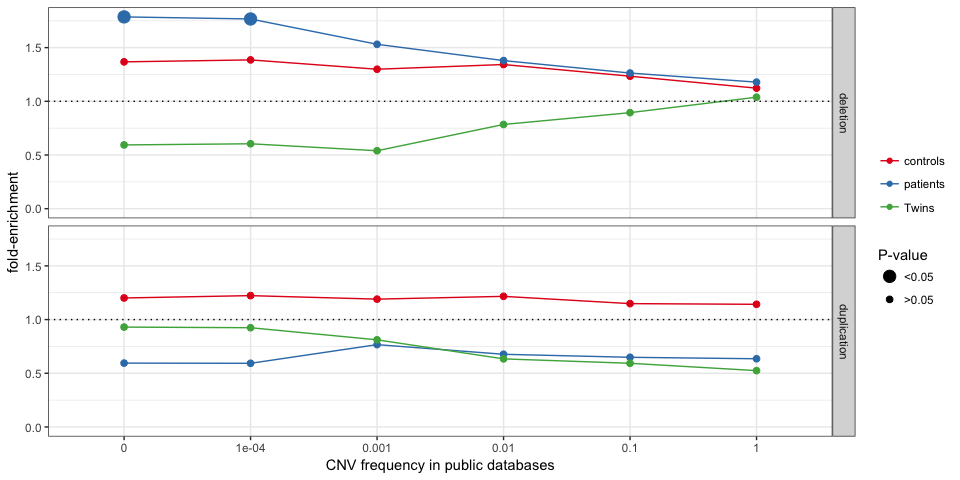

### Exploring the enrichments

Here again, the number of permutations has been decreased compared to what was used in the study.

``` r
cnv.sets = cnv.all %>% mutate(type = ifelse(z < 0, "deletion", "duplication")) %>% 
    select(project, sample, chr, start, end, type) %>% as.data.frame
cnv.sets$prop.db = cnv.sets %>% makeGRangesFromDataFrame(keep.extra.columns = TRUE) %>% 
    dbProp(., svs.gr)

load("../data/cnvs-PopSV-twin-5kbp-FDR001.RData")
tw.sets = res.df %>% mutate(project = "Twins", type = ifelse(z < 0, "deletion", 
    "duplication")) %>% select(project, sample, chr, start, end, type)
tw.sets$prop.db = tw.sets %>% makeGRangesFromDataFrame(keep.extra.columns = TRUE) %>% 
    dbProp(., subset(svs.gr, project != "PopSV"))
cnv.sets = rbind(cnv.sets, tw.sets)
```

``` r
freq.r = c(1, 0.1, 0.01, 0.001, 1e-04, 0)
enr.epi.freq = lapply(freq.r, function(freq.max) {
    cnv.sets %>% filter(prop.db <= freq.max) %>% group_by(project, type) %>% 
        do(testGenesCnvs(., nb.perm = 1000)$sum.df) %>% mutate(freq = freq.max)
})
enr.epi.freq = do.call(rbind, enr.epi.freq)
```

``` r
ggplot(enr.epi.freq, aes(x = factor(freq), y = odds.ratio, colour = project, 
    group = project)) + geom_line() + geom_point(aes(size = cut(pv, c(0, 0.05, 
    1)))) + theme_bw() + ylim(0, max(enr.epi.freq$odds.ratio)) + scale_colour_hue() + 
    geom_hline(yintercept = 1, linetype = 3) + scale_size_manual(name = "P-value", 
    labels = c("<0.05", ">0.05"), values = c(4, 2)) + xlab("CNV frequency in public databases") + 
    facet_grid(type ~ .) + ylab("fold-enrichment") + scale_colour_brewer(name = "", 
    palette = "Set1")
```


